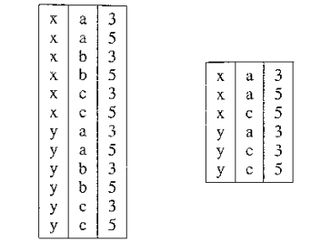
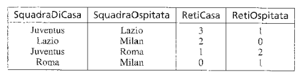
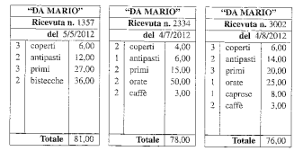
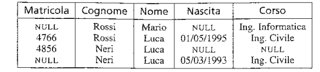

Maggior parte dei DB si basa sul modello relazionale che permette di realizzare la proprietà di indipendenza dei dati. L'affermazione è stata lenta a causa dell'alto livello di astrazione e quindi della difficoltà di trovare delle strutture efficienti e diverse rispetto a quelle iniziali.

> Il modello è stato introdotto negli anni '70 da E.F. Codd.

---
### Il modello relazionale: strutture

Il modello relazionale si basa su due concetti: **relazione** e **tabella** - diversi ma riconducili.
Questi due concetti - uno matematico - l'altro intuitivo - ci permettono di implementare correttamente il modello.

> La tabella è un concetto facile anche per gli utenti finali - mentre le relazioni semplificano la creazione del modello perché ci permette di avere una formalizzazione teorica.

Il modelllo relazionale ci permette di avere l'indipendenza dei dati - quindi la distinzione dei dati fra il livello *logico* e *fisico.*

> Gli utenti finali fanno riferimento solo al livello logico; I dati descritti nel livello logico sono organizzati in strutture fisiche.

> I modelli precendenti facevano riferimenti *espliciti* alla struttura sottostante di riferimento.

Una precisazione sul termine *relazione* - questo viene usato con significati diversi:

- **Relazione matematica** - Che richiama la teoria degli insiemi.

- **Relazione** del modello relazionale -  Presenta delle differenze rispetto alla definizione matematica.

- **Relazione** come *relationship* - Costrutto del modello concettuale *Entità-Relazione*.

> Il modello relazionale è un modello logico.

Guardiamo nel dettaglio le relazioni.

---
**Relazioni e tabelle**

In matematica - dati due insiemi $D_1$ e $D_2$ - si chiama **prodotto cartesiano** l'insieme delle coppie ordinate $(v_1, v_2)$ tali che $v_1 \in D_1$ e $v_2 \in D_2$. Per esempio se abbiamo $A = [1,2,4]$ e $B = [a, b]$ - il prodotto cartesiano sarà: $$D_1 \times D_2 = [(1,a),(1,b)(2,a)(2,b)(3,a)(3,b)]$$
Una **relazione matematica** è un sottoinsieme di questo risultato - queste relazioni possono essere rappresentate come delle tabelle. Di seguito le rappresentazioni tabellari del prodotto cartesiano e di una possibile relazione.

> Siccome le nostre basi di dati sono memorizzati su sistemi di dimensione finita - le relazioni devono essere per forza finite.

Possiamo generalizzare il prodotto cartesiano su $n$ insiemi e inoltre possiamo fare il prodotto cartesiano di insieme che hanno diversi tipi di elemento. Il risultato del prodotto cartesiano su $n$ insiemi è l'insieme delle $n-uple\;\;(v_1,v_2,...v_n)$ tali che $v_i$ appartiene a $D_i$ con $1 \leq i \leq n$.

> Il numero $n$ è detto *grado* del prodotto cartesiano, il numero di elementi della relazione invece è chiamato *cardinalità*.

---
**Relazioni con attributi**

Ogni $n-upla$ contiene dei dati che sono collegati fra di loro. Notiamo che:

- **Non ci sta ordinamento** fra le $n-uple$. Ci sta un ordine ma è 'occasionale'. Tabelle con le stesse roghe in ordine diverso rappresentano la stessa relazione.

- Le $n-uple$ di una relazione **sono distinte l'una dall'altra.** Tra gli elementi di un insieme non possono esistere due righe uguali.

Ogni $n-upla$ - al proprio interno - è *ordinata* - l'$i-esimo$ valore equivale all'$i-esimo$ dominio. Questo avviene perché le occorrenze sono distinte attraverso la posizione.

Una relazione è un insieme di record omogenei - cioè definiti sugli stessi campi. Nel caso dei record - ad ogni campo - è associato un **nome** - detto **attributo** che descrive il ruolo giocato dal dominio stesso.

> Gli attributi di una relazione devono essere unici.

Avendo introdotto gli attributi - ora non abbiamo più bisogno di un ordine delle colonne. Non ci serve più parlare di domini siccome possiamo fare riferimento direttamente agli attributi.

Formalizziamo i concetti: Indichiamo con $D$ l'insieme dei domini. La funzione $$dom:X\to D$$ Associa a ciascun attributo $A\in X$ un dominio $dom(A)\in D$. Diamo ora la definizione:

> Una *relazione* su $X$ è un insieme di tuple su $X$. La differenza con la definizione matematica risiede nella definizione di tupla. In matematica abbiamo le $n-uple$ i cui elementi sono individuati per posizione - nella nuove definizione gli elementi delle tuple sono individuati per mezzo di attributi - quindi non posizionale.

Introduciamo una nuova notazione: Se $t$ è una tupla su $X$ e $A\in X$ - allora $t[A]$ (o $t,A$) - indica il valore di $t$ su $A$.

Se per esempio $t$ è la prima tupla della relazione dell'immagine sopra allora: $$t[SquadraOspitata] = Lazio$$

---
**Relazioni e basi di dati**

Solitamente non è abbastanza creare una singola relazione per organizzare i dati che ci interessano.

> Le basi di dati contengnono diverse relazioni.

Le tuple delle relazioni devono contenere dei valori comuni che permettono di stabilire le corrispondenze.

Una delle caratteristiche fondamentali del modello relazionale - indicato con *basato su valori* - è che i riferimenti fra dati in relazioni diverse sono rappresentate per mezzo dei domini che compaiono nelle tuple.

> $D_1...D_n$ sono i domini della relazione - cioè i valori che la relazione può assumere.

> Altri modelli - reticolare e gerarchico - fanno i riferimenti tramite puntatori

Il modello reticolare basato su valori ha diversi vantaggi:

- Richiede di rappresentare solo ciò che interessa dal punto di vista dell'applicazione. I puntatori sono solo aggiuntivi  e sono legati ad aspetti realizzativi.

- La rappresentazione logica non fa riferimento a quella fisica - che può cambiare. Il modello permette di ottenere **l'indipendenza fisica dei dati.**

- Siccome i dati sono contenuti in valori - è semplice trasferire dati da un contesto all'altro.

> Nota: Nel modello relazionale i dati possono essere rappresentati tramite puntatori - ma a livello logico questi non sono visibili.

Riassumiamo le definizioni relative al modello relazionale:

- *Schema di relazione* costituito dal simbolo $R$ detto *nome della relazione* e da un insieme di attributi $X = [A_1,A_2,.....,A_n]$ - indicato con $R(X)$

> Essenzialmente ad ogni attributo è associato un dominio.

- *Schema di base di dati* è un insieme di schemi di relazione - i nomi hanno lo scopo di distinguere le varie relazioni nella base di dati: $$R=[R_1(X_1),R_2(X_2),....,R_n(X_n)]$$
- *Istanza della relazione* o *relazione* su uno schema $R(X)$ è un insieme di $r$ di tuple su $X$. si identifica con la relazione $r(X).$

- *istanza di base di dati* o *base di dati* su uno schema $R=[R_1(X_1),R_2(X_2),...,R_n(X_n)]$ è un insieme di relazioni $r = [r_1,r_2,...r_n]$ dove ogni $r_i$ è una relazione sullo schema $R_i(X_i)$

> Notiamo che è ammissibile una relazione su un solo attributo.

Uno dei problemi maggiori del sistema relazionale è mappare delle strutture nidificate.
Possiamo semplificare questa mappatura spezzando le informazione in diverse tabelle.

Ovviamente possiamo avere delle rappresentazioni diverse in base a quello che dobbiamo rappresentare.

> Notiamo che - sia pur indirettamente - il modello di dati permetta di rappresentare informazioni strutturate in modo articolato.

---
**Informazione incompleta e valori nulli**

Il modello relazionale è semplice e potente - ma molto rigido - infatti le informazioni devono essere rappresentate per mezzo di tuple di dati omogenee e solo alcuni formati di tuple sono ammssi. Il problema nasce nel momento in cui dobbiamo rappresentare **l'assenza di un dato**. Possiamo gestire questo problema in due modi:

- Possiamo utilizzare un **simbolo noto** - come lo $0$ - per rappresentare l'assenza - è abbastanza scomodo da usare perchè stiamo sprecando un valore del dominio.

- Estendiamo il concetto di relazione prevedendo che una tupla possa assumere un *valore speciale* detto **valore nullo.** Usiamo il simbolo NULL.

> Il valore NULL **denota l'assenza di un valore del dominio** e NON è parte del dominio.

Notiamo che per alcune informazioni è impossibile avere un valore NULL perché renderebbe inutilizzabile la base di dati - per esempio il numero di matricola non può essere NULL.

> Quindi non tutti gli attributi possono assumere il valore NULL.

NULL potrebbe essere un valore **sconosciuto**, **inesistente** o **senza informazione**. I DBMS non distinguono i tipi di valore nullo.

---
### Vincoli di integrità

Non tutte le relazioni sono ammissibili - per esempio se una persona prende un 28 ad un esame non può avere la lode - è quindi oppurtuno evitare queste situazioni.

Questo è il concetto di **vincolo d'integrità** - ossia le istanze devono rappresentare informazioni corrette per l'applicazione. Possiamo vedere ogni vincolo come un *predicato* che può assumere il valore vero - se l'istanza soddisfa il vincolo - altrimenti falso.

Ad uno schema di dati associamo un insieme di vincoli e consideriamo corrette le istanza che soddisfano tutti i vincoli. 

- Un vincolo è **intrarelazionale** se il suo soddisfacimento è relativo a singole relazioni della base di dati. Questi sono divisibili in *vincoli di tupla* - ossia che il vincolo può essere valutato su ciascuna tupla indipendentemente dalle altre. Altrimenti *vincoli di dominio* - ossia che impone una restrizione sul dominio dell'attributo.

- Un vincolo è **interrelazionale** se coinvolge più relazioni.

I vincoli che guarderemo in dettaglio saranno:

- Classe interessante di vincoli di tupla.
- I vincoli di chiave - più importanti dei vincoli intrarelazionali.
- I vincoli di integrità referenziale - vincoli interrelazionali di maggiori interesse.

---
**Vincoli di tupla**

Esprimono condizioni sui valori di ciascuna tupla - indipendentemente dalle altre tuple.
Possiamo rappresentare questi vincoli tramite espressioni booleane: $$(Voto\geq18)\;\;\;AND\;\;\; (Voto \leq 30)$$
Oppure: $$(NOT(LODE = 'lode'))\;\;\;OR\;\;\; (Voto = 30)$$
Possiamo ammettere anche espressioni più complesse purché definite sui valori delle singole tuple.

---
**Chiavi**

Una chiave è un insieme di di attributi che vengono utilizzati per andare ad identificare univocamente le tuple di una relazione  - per esempio l'attributo matricola.

Formalizziamo questo concetto:

- Un insieme $K$ di attributi è **superchiave** di una relazione $r$ se $r$ non contiene due tuple distinte  $t_1$ e $t_2$ con $t_1[K] = t_2=[K]$.

- $K$ è la chiave di $r$ se è una superchiave minimale di $r$ - cioè non esiste un'altra superchiave $K'$ di $r$ che sia contenuta in $K$ come sottoinsieme proprio.

>**Superchiave** è qualsiasi insieme di attributi che può identificare univocamente le tuple. **Chiave** è una superchiave che non ha attributi ridondanti: è minimale.

Consideriamo corrette solo le istanze che seguono tutti vincoli imposti. In ciascuna relazione e ciascuno schema di relazione abbiamo sempre una chiave. 

> Il fatto che su ogni schema di relazione è definita una chiave ci garantisce l'accessibilità a tutti i valori di una base di dati e la loro univoca identificabilità.

---
**Chiavi e valori nulli**

Quindi abbiamo trovato diverse chiavi per una relazione - ma cosa succede se in una relazione abbiamo troppi valori NULL?

Essenzialmente in alcuni casi le chiavi perdono il loro senso perché non permettono di andare ad identificare in modo univoco le tuple.

Nell'esempio sopra non possiamo inserire una nuova tupla con Mario Rossi perché non sappiamo se ci stiamo riferendo allo stesso studente o ad un altro.

Dobbiamo imporre dei limiti alla presenza di valori nulli - la soluzione è semplice e ci permette *l'identificazione univoca di tutte le tuple* e *la possibilità di far riferimento ad esse da altre relazioni.* Su una delle chiavi - la **chiave primaria** - si vieta la presenza di valori nulli.

> Evidenziamo questa caratteristica con una sottolineatura nella relazione.

> Se non ci sta un attributo che può essere chiave possiamo introdurre nella relazione un codice identificativo.

---
**Vincoli di integrità referenziale**

Un *vincolo di integrità referenziale* fra un insieme di attributi su $X$ di una relazione $R_1$ e un'altra relazione $R_2$ è soddisfatto se i valori su $X$ di ciascuna tupla dell'istanza di di $R_1$ compiaono come i valori della chiave primaria dell'istanza di $R_2$.

>I vincoli di integrità referenziale collegano diverse tabelle (relazioni) tramite i valori in comune. Sono anche detti **chiavi esterne (foreign key)**.

Dobbiamo stare attenti con la definizione perché dobbiamo considerare i casi in cui la chiave è costituita da più attributi e nel caso vi siano più chiavi.

Vediamo il caso in cui la chiave di $R_2$ è unica e composta da un solo attributo $B$ - quindi l'insieme $X$ è costituito solo da l'attributo $A$ - il vincolo di integrità sarà soddisfato se - per ogni tupla $t_1$ in $R_1$ per cui $T_1[A]$ non è nullo - esiste una tupla $t_2$ in $R_2$ tale che $t_1[A] = t_2[B]$.

Nel caso generale facciamo attenzione al fatto che ciascuno degli attributi in $X$ deve corrispondere a un preciso attributo della chiave primaria $K$ in $R_2$. E' quindi necessario specificare un ordinamento sia nell'insieme $X$ sia in $K$. Indicando gli attributi in ordine $X=A_1A_2...A_p$ e $K=B_1B_2...B_p$ il vincolo è soddisfatto se per ogni tupla $t_1$ in $R_1$ senza nulli su $X$ esiste una tupla $t_2$ in $R_2$ con $t_1[A_i]=t_2[B_i]$ per ogni $1\leq i\leq p$.

