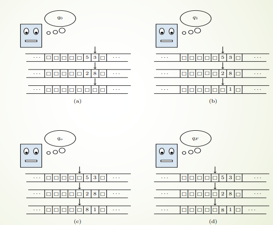

# 1 - Introduzione alla calcolabilità

Obiettivo del corso è quello di studiare i fondamenti teorici che hanno portato alla costruzione del calcolatori moderni e delle metodologie di analisi dei problemi rispetto alla loro possibilità ad essere risolti *automaticamente* ed in maniera *efficiente*.

---
### 1.1 - La logica di Aristotele

La logica Aristotelica è raccolta in una serie di scritti dal titolo complessivo *Organon* - cioè strumento. La parola usata da Aristotele per descrivere i suoi studi è *analitica* - che indica un **metodo di risoluzione del ragionamento ai suoi elementi costitutivi**.
Il termine *logica* nasce invece come *scienza dei "logoi"* - ossia scienza dei discorsi - riferendosi al suo oggetto di studio: il pensiero nei discorsi.
Per Aristotele - la logica non era una scienza a sé stante - bensì era lo studio della struttura della scienza in generale. Infatti secondo Aristotele esiste un *rapporto necessario* fra le dorme del pensiero - studiate dalla logica - e le forme della realtà - studiate dalla **metafisica.**

Alla base della logica Aristotelica troviamo le **proposizioni** - cioè affermazioni che possono assumere due valori: *vero* o *falso*. La logica si fondava su tre principi:

- **Principio di identità:** Ogni proposizione è uguale a sé stessa.

- **Principio di non contraddizione:** Non possono essere contemporaneamente vere sia una proposizione che la sua negazione.

- **Principio del terzo escluso:** Fra una proposizione e la sua negazione, almeno una di esse deve essere vera.

Sull'ultimo principio si bassa la tecnica di *dimostrazione per assurdo*. Il principio di non contraddizione è il perno di ogni ragionamento. Di seguito un piccolo pezzo preso dalla metafisica di Aristotele:

>“E' impossibile che la stessa qualità appartenga e non appartenga alla stessa cosa.Questo è il più certo di tutti i principi . . . Per questa ragione tutti coloro che eseguono qualche dimostrazione si riferiscono ad esso come a una conoscenza fondamentale. Esso è infatti, per natura, la fonte di tutti gli altri assiomi."

Aristotele introdusse anche il ragionamento per *sillogismo* - un tipo di ragionamento che - partendo da tre tipi di termine - giunge ad una *conclusione* collegando i termini attraverso delle *premesse*:

*Socrate è un uomo*                         (Premessa maggiore)
*Tutti gli uomini sono mortali*          (Premessa minore)
*Allora, Socrate è mortale*                (Conclusione).

I termini di un sillogismo sono detti *maggiore* - predicato nella conclusione - *medio* (uomo e uomini) e *minore* - il soggetto nella conclusione.

Le proposizione che compongono un sillogismo possono essere:

- **Universali affermative** - "Tutti gli A sono B"
- **Universali negative** - "Nessun A è B"
- **Particolari affermative** - "Qualche A è B"
- **Particolari negative** - "Qualche A non è B"

Il sillogismo precedente risponde alla **regola di inferenza** detta *modus ponens*: $$[(p \to q) \land q] \Rightarrow q$$
>“se so che ogni volta che è vera $p$ anche $q$ è vera, e mi accorgo che, nel mio caso particolare, $p$ è vera, allora posso dedurre che, nel mio caso particolare, $q$ è vera”.

Un altra regola di inferenza è il *modus tollens*: $$[(p \to q) \land \neg q] \Rightarrow \neg p$$
>“se so che ogni volta che è vera  $p$ anche $q$ è vera, e mi accorgo che, nel mio caso particolare, $q$ è falsa, allora posso dedurre che, nel mio caso particolare, $p$ è falsa”.

Il sillogismo è una **regola di inferenza** - nella logica matematica - l'atto di tratte conclusioni basandosi sulla forma di premesse. Se una regola di inferenza è corretta allora stabilisce quando un enunciato è conseguenza logica di un altro *soltanto sulla struttura sintattica degli enunciati.*
Possiamo considerare il sillogismo come il primo passo verso l'automatizzazione dei processi deduttivi - ossia ciò che chiamiamo **calcolabilità**.

---
### 1.2 - Il sogno di Leibniz

Affascinato dal sistema logico di Aristotele - Leibniz sviluppò la sua idea di creare un alfabeto speciale i cui elementi non stessero per suoni - ma per **concetti**. Il primo risultato era quella di una macchina in grado di eseguire le quattro operazioni fondamentali.

> .".. è indegno di uomini eccellenti perdere ore come schivi nelle fatiche di calcoli che potrebbero essere tranquillamente affidati a chicchessia se si usasse questa macchina."

Descrisse una macchina in grado di risolvere equazioni algebriche e in uno dei suoi scritti paragonò il ragionamento logico ad un meccanismo. L'idea principale era quella di *ridurre ogni ragionamento a una sorta di calcolo e costruire, da ultimo, una macchina capace di "calcolare" in questo senso generale*.

Nel seicento ci fù un'esplosione della ricerca matematica dovuta da due innovazioni:

1) La manipolazione delle espressioni algebriche era stata sistematizzata.
2) Cartesio e Fermato mostrarono che la geometria era riconducibile all'algebra.

Queste permettevano di risolvere problemi un tempo inaccessibili. Nei calcoli intervenivano **processi di limite** - quindi di approssimazioni che si avvicinavano al risultato. E tramite questi processi - Leibniz sviluppò diversi risultati che costituiscono l'invenzione leibniziana del calcolo infinitesimale:

1) Riconobbe che il calcolo delle aree e la determinazione dei rapporti incrementali puntuali erano casi paradigmatici.

2) Le operazioni usate per risolvere i problemi descritti sopra erano l'inversa l'una dell'altra - integrazione e derivazione. Questa proprietà è not come **Teorema fondamentale del calcolo integrale.**

3) Inventò simboli per l'integrazione e derivazione. Scoprì le regole matematiche per eseguire concretamente integrazioni e derivazioni.

Nel loro insieme queste scopertoe semplificarono i passaggi al limite permettendo l'insegnamento a generezioni di student. Ancora più importante era che Leibniz si convinse che era **fondamentale scegliere simboli adatti e trovare regole che ne governassero la manipolazione.**
I simboli di integrazione e derivazione rappresentano dei concetti - questi alimentarono l'idea che Leibniz ha avuto fin da bambino - **Un alfabeto che rappresentasse tutti i concetti fondamentali.**
Un sistema simbolico preciso, univoco, coerente e completo era chiamato *caratteristica*. In una caratteristica reale ogni simbolo rappresenta un'idea ben definita in modo naturale e adeguato. Leibniz voleva sviluppare un **caratteristica universale** - un sistema di simboli che potesse abbracciare l'interezza del pensiero umano.

Leibniz divideva il suo programma in tre parti:

1. Creare un modello che abbracciasse l'intera conoscenza umana.

2. Scegliere le nozioni fondamentali e cruciali e individuare  per ciascuna di esse i simboli adeguati.

3. Ridurre le regole deduttive a manipolazioni di questi simboli - ovvero in un'algebra della logica chiamata *calculus ratiocinator*.

Una volta espresso un concetto in tale linguaggio, per analizzare le proprità sarebbe stato sufficiente dire: **Calcolemus.**

---
### 1.3 - Cosa significa calcolemus

Consideriamo un problema di geometria euclidea:

>Si consideri un trapezio isoscele $ABCD$ avente la diagonale perpendicolare al lato obliquo, la cui base minore $AB$ misuri $7 cm$ e la cui base maggiore $CD$ misuri $12 cm$. Calcolare il perimetro e l’area del trapezio.

Esistono diversi approcci al problema:

- Il primo è una serie di ragionamenti sulle figure con cui stiamo lavorando che richiede delle deduzioni tutt'altro che *automatiche*.

- Il secondo è tramite un sistema di equazioni.

Vediamo che una volta impostato il sistema possiamo giungere alla soluzione di un problema tramite una **serie di calcoli che possono essere svolti da una macchina.**
Osserviamo anche che l'impostazione del sistema non è nient'altro che la riscrittura dei dati del problema - ossia che:

> La teoria dei sistemi di equazioni è un linguaggio che ci permette di rappresentare i dati dei nostri problemi in modo tale che, una volta descritto un problema in tale linguaggio, la sua soluzione diventa un procedimento pressoché automatico.

Quindi impostiamo il sistema e poi calcoliamo.

---
### 1.4 - Problemi, istanze e algoritmi

Prima di dare le definizioni definiamo delle notazioni:

- $\Sigma$ è un insieme finito (il nostro alfabeto: Insieme di caratteri).
- $\Sigma*$ è l'insieme di tutte le sequenze di $0$ o più caratteri di $\Sigma$ che chiameremo parole.
- La parola di $0$ caratteri in $\Sigma*$ è la parola vuota e sraà denotata con $\epsilon$.

- Date due parole $x$ e $y$ in $\Sigma*$, indichiamo con $xy$ la concatenazione di $x$ e $y$ - se $x = x_1x_2...x_n$ e $y=y_1y_2...y_n$ allora $xy$ è $x_1x_2...x_ny_1y_2...y_n$.

- Data $x = x_1x_2...x_n\in \Sigma*$, la parola inversa di $x$ è $x^{-1} = x_nx_{n-1}...x_1$.

- Data $x = x_1x_2...x_n \in [0,1]*$, la parola complemento di $x$ è $x^c = y_1y_2...y_k$ tale che, per $i=1, ..., n$, $y_i = 0$ se $x_i = 1$ e $y_i = 1$ se $x_i = 0$.

> Un problema è definito da un insieme di istanze, per ciascuna delle quali è necessario trovare una soluzione che rispetti i vincoli del problema.

> Una istanza del problema è un insieme di dati.

> Una soluzione di una istanza del problema è un insieme di valori, correlati ai dati, che rispettano l'insieme dei vincoli del problema.

Notiamo anche che la soluzione di un problema potrebbe esistere anche se non la troviamo. Trovare una soluzione ad un problema significa quindi: *Estrarre informazione nascosta (implicita) dall'informazione in nostro possesso (esplicita).*

Esistono diverse metodi di risoluzioni o - nel linguaggio informatico - **algoritmi**.

> Un algoritmo è la descrizione di una sequenza di passi elementari che permettono ad un qualche esecutore di calcolare una soluzione di un provlema a partire da una sua qualsiasi istanza.

---
**Esempio:**

"Quanto fa 5+2?" - Questo NON è un problema, ma un'**istanza** - il problema a cui stiamo facendo riferimento è il problema somma.

>Dati due numeri naturali, $n$ e $k$ calcolare il valore della somma di $n$ con $k$.

Quindi un problema è la descrizione di un insieme di parametri, cioè i **dati**, collegato da un certo insieme di relazioni, associata alla richiesta di derivare da essi un altro insieme di parametri che costituiscono la soluzione.

---

Risolvere un problema significa individuare un metodo che ci permette di trovare una soluzione di **qualunque** istanza positiva del problema.

> Quando un'istanza di un problema non ha soluzione diciamo che essa è un'**istanza negativa.**

Dobbiamo quindi trovare un procedimento che, data una qualunque istanza del problema, indichi la sequenza di azioni che devono essere eseguite per trovare la soluzione di quell'istanza. Sono tre le domande che adesso ci possiamo porre:

1) Cos'è un procedimento?
2) Cos'è una azione?
3) Chi deve eseguire le azioni indicate?

Un procedimento è la descrizione di un insieme di azioni unita alla specifica dell'ordine con il quale le azioni devono essere eseguite.

> Le azioni prendono il nome di **istruzione**.

Queste istruzioni devono essere elementari, cioè eseguite con facilità. Da notare che **la 'complessità' dell'istruzione dipende dal soggetto che la deve eseguire.**

---
**Esempio**

Per un matematico svolgere un intergrale fondamentali è semplice, per un bambino delle elementari no.

---
### 1.5 - L'istruzione elementare

Dobbiamo svincolare la definizione di procedimento risolutivo da quello di esecutore delle azioni in esso indicate. Per descrive un istruzione elementare usiamo la soluzione individuata da Alan Turing:

Un'istruzione si può definire elementare se ha le seguenti caratteristiche:

 1) Viene scelta da un insieme di 'poche' istruzioni.
 
 2) Deve scegliere l'azione da seguire da un insieme di 'poche' azioni possibili.
 
 3)  Dobbiamo poterla eseguire ricordando una quantità limitata di dati - ossia una quantità limitata di memoria.

---
**Esempio**

Riprendiamo il problema della somma; Se $n=37849$ e $k=465839$ - guardanfo i due addendi è impossibile svolgere a mente questa operazione.

Però se disponessimo di una tabella sufficientemente grande potremmo svolgere la somma in maniera istantanea.

Ma - il problema somma - per risolverlo - ci richiede di indicare il procedimento per addizionare *qualunque* coppia di numeri naturali e se volessimo considerare la somma di questi numeri un'istruzione elementare **necessiteremo di una tabella infinita.**

La nostra memoria è limitata - per questo motivo per eseguire la somma di una qualunque coppia abbiamo bisogno di un *procedimento* che:

- Usa un numero limitato di operazioni elementari (Somme di coppie ad una cifra).

- In cui ogni operazione elementare usa una quantità limitata di dati (Due cifre e il riporto). 

Possiamo descrivere il procedimento per calcolare la somma in colonna di due numeri naturali in questo modo:

1) Posizionati sulla coppia di cifre più a destra e poni $r=0$.

2) Fino a quando leggi una coppia di cifre - esegui la somma della coppia di cifre sulle quali sei posizionato - aggiungi $r$ a tale valore e scrivi una cifra del risultato calcolando anche il nuovo valore di $r$ - poi spostati a sinistra.

3) Fino a quando leggi una sola cifra aggiungi $r$ ad essa e scrivi una cifra del risultato calcolando il nuovo valore di $r$ - poi spostati a sinistra.

4) Se le cifre di entrambi i numeri sono terminate - allora calcola l'eventuale ultima cifra del risultato - se $r = 0$ e le cifre sono terminate - allora termina - se $r=1$ e le cifre sono terminate - allora scrivi $1$ è termina.

Questo procedimento è una sequenza di: **Se sono vere *certe condizioni* allora esegui *queste azioni.*** Ad ogni coppia (Certe condizioni, queste azioni) corrisponde un'istruzione.

In questo caso:

- *Certe condizioni* è ciò che viene letto e il valore del riporto.

- *Queste azioni* è ciò che viene scritto - la modifica del valore del riporto e lo spostamento.

Le istruzioni che abbiamo visto sono davvero elementari? Sicuramente il terzo punto nella definizione di Turing è confermato - ma gli altri due?

Le azioni che possiamo eseguire sono due - scrittura di una cifra e spostamento - che sono poche. Per quanto riguarda le istruzioni possibili ne abbiamo $200$.

> Numero di coppie di cifre X numero di possibili valori per il riporto = $200$.

Ricapitoliamo - abbiamo $200$ istruzioni che eseguono 2 azioni utilizzando una memoria a $3$ cifre. Queste sono tutte **costanti.**

> Il numero di istruzioni, azioni e la quantità di memoria necessaria sono **costanti** - cioè non dipendono dall'input.

Possiamo dire che le istruzioni, le azioni e la quantità di memoria che ci serve per eseguire un programma di definisce elementare se prese da un insieme di poche istruzioni e azioni - cioè se il numero di istruzioni/azioni è finito e costante.

Le istruzioni ti dicono **per ogni condizione possibile, esattamente quali azioni deve eseguire per quelle condizioni.**

Quindi l'insieme delle istruzioni è **non ambiguo** - non ci possono essere due (o più) istruzioni che, a partire dalle stesse condizioni ti indicano diverse azioni da eseguire.

L'ordine in cui dobbiamo eseguire le istruzioni è indicato implicitamente dal meccanismo del *"se .... allora"*.

> Per ottenere il risultato di un'istanza **devi** eseguire le istruzioni. Questa idea è alla base di molti linguaggi di programmazione detti **imperativi.**

Per eseguire questo procedimento bisogna solo sapere leggere, scrivere e distriguere da sinistra e destra - quindi anche un **automa** potrebbe svolgerlo.

---
### 1.5.1 - Risolvere automaticamente un problema

Informalmente, *risolvere automaticamente un problema* significa progettare un **procedimento** che risolve **tutte** le istanze di quel problema e che può essere eseguito da un automa.

> Cioè da un esecutore che non ha alcuna idea del significato del problema e delle istruzioni.

---
### 1.6 - Un nuovo linguaggio

Ripensiamo alla somma:

1) Il procedimento è costituito da sole istruzioni "se sono vere certe condizioni allora esegui azioni".

2) In ciascuna istruzione le possibili azioni sono 3.

3) Le condizioni dipendono da due parametri (Valore del riporto e cifre da sommare).

Il valore del riporto lo taniamo a mente - cioè caratterizza il nostro **stato interiore**.

Possiamo ora riscrivere le nostre istruzioni in una forma compatta. 
Ad esempio:

*Se $r = 0$ e le due cifre sono $4$ e $6$, allora scrivi $0$, poni $r = 1$, e spostati di una posizione a sinistra.* Lo scriviamo come: $$<q_0,(4,6),0,q_1,sinistra>$$
Dove $q_0$ e $q_1$ indicano gli stati possibili del riporto.

*se $r = 1$ e l’unica cifra è $5$, allora scrivi $6$, poni $r = 0$, e spostati di una posizione a sinistra.* Lo scriviamo come: $$<q_1,(\square,5),0,q_1,sinistra>$$ oppure:
$$<q_1,(5,\square),0,q_1,sinistra>$$ Dove $\square$ significa che non viene letto alcun simbolo. Infine le istruzioni:

*Se r = 1 e le cifre di entrambi i numeri sono terminate, allora scrivi 1 e termina* e *se r = 0 e le cifre di entrambi i numeri sono terminate, allora termina*. Le possiamo scrivere come: $$<q_1,(\square,\square),1,q_F,fermo>$$$$<q_0,(\square,\square),\square,q_F,fermo>$$ 
Dove $q_F$ è lo stato interiore che permette all'esecutore di comprendere che non deve più eseguire alcuna istruzione.

Rappresentiamo graficamente il nostro automa - facendogli sommare $53$ e $28$.
Rappresentiamo l'automa come una specie di *testa robotizzata* che si può trovare nei seguenti stati interiori: $q_1,q_2,q_F$. E che usa tre nastri - divisi in celle e di lunghezza infinita - tali che possano contenere o una cifra o sono vuoti. L'ultima cosa sono 3 testine di lettura/scrittura.

Non appena viene scritto qualcosa sul nastro, l'automa comincia a **computare** - cioè a eseguire le quintuple del procedimento.

---
### 1.7 - Quasi una macchina di Turing

Questa che abbiamo visto è *quasi* una macchina di Turing. Perchè abbiamo usato tre nastri e occore quindi descrivere cosa viene letto e scritto per ogni nastro - quindi l'istruzione: *Se r = 0 e le due cifre sono 4 e 6, allora scrivi 0, poni r = 1, spostati di una posizione a sinistra e torna al punto 2)*. Diventa: $$<q_0, (4,6,\square),(4,6,0),q_1,sinistra>$$
Specifica che sui tre nastri $(4,6,\square)$ vanno scritti $(4,6,0)$. Poichè specifica 2 condizioni e 3 azioni - essa prende il nome di **quintupla.** Quelli che abbiamo chiamato stati interiori - li chiameremo **stati interni**. L'esecuzione delle quintuple su un insieme fissato di dati si chiama **computazione.**

---
### 1.8 - Calcolabilità

Quella vista è una descrizione informale di una **macchina di Turing** (m minuscola) che è la descrizione di un procedimento di risoluzione espresso nel linguaggio definito da Turing.

Il linguaggo che costituisce un modello di calcolo: Il modello **Macchina di Turing** (M maiuscola).
