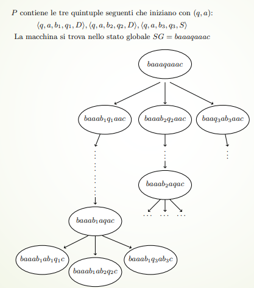

# 5 - macchine non deterministiche

Notiamo che per conoscere tutto di una macchina $T$ posssiamo controllare soltanto $P$ - ossia l'insieme delle quintuple. Da esso infatti possiamo ricavarare tutto il resto cioè $\Sigma,Q$ - nonché le azioni che la macchina deve prendere quando si trova in un certo stato e legge un certo simbolo.

> Una quintupla è **un'istruzione** del linguaggio associato alle macchine di Turing.

Possiamo vederla anche come istruzione condizionale:

> *Se la macchina T si trova nello stato* $q_1\in Q$ *e legge il simbolo* $s_1\in \Sigma$ *sul nastro - allora deve scrivere sul nastro il simbolo* $s_2$ *assumere lo stato interno* $q_2$ *e muovere la testina in accordo a quanto specificato da* $m$.

Quindi $P$ è una corrispondenza che associa ad elementi dell'insieme $Q\times \Sigma$ elementi dell'insieme $\Sigma \times Q \times [destra,sinistra,fermo]$.

> Ossia condizioni dell'istruzioni e istruzioni da intraprendere. 

Possiamo vedere $P$ come una **funzione di transizione** $\delta:Q\times \Sigma \to \Sigma \times Q \times [S,F,F]$.

Inanzitutto discutiamone la totalità - ossia per ogni **coppia** di condizioni esiste una **tripla** di azioni da eseguire tale che la quintupla formata appartenga a $P$? Se $\delta(q,s)$ non è definita allora *non viene indicata alcuna azione* da compiere.

> $T$ interrompe la sua computazione come se avesse raggiunto uno stato finale - ma non lo ha raggiunto.

Inoltre la totalità della funzione dipende anche dalla verifica di alcune precondizioni - infatti quando costruiamo una qualsiasi macchina **assumiamo** che l'input venga scritto in un certo formato. Quindi $P$ può non essere totale.

> Il codice di una macchina di Turing deve essere sempre fornito con le specifiche delle precondizioni rispetto alle quali garantiamo il corretto funzionamento della macchina.

In questo modo possiamo *guidare l'utente* al corretto funzionamento risparmiandoci anche il lavoro di dover scrivere tante quintuple per il controllo dell'input errato.

Per capire cosa significa raggiungere uno 'stop' senza avere raggiunto uno stato finale dobbiamo prima capire che cosa significa che ad una coppia $(q,s)$ non è associata alcuna quintupla in $P$ - facciamolo separatamente per trasduttori e riconoscitori.

---
### $\delta$ è una funzione totale? (Trasduttori)

Mentre un trasduttore lavora - man mano che esegue le sue quintuple - è possibile che scriva sul nastro di output la prima parte del risultato. Se la computazione termina perché $T$ non trova più quintuple da eseguire - e non si trova in uno stato finale - allora *quel che è scritto sul nastro di output non sarà il risultato cercato*.

Come fa l'utente a capire che il risultato è sbagliato? Abbiamo due modi:

1) Chi progetta $T$ considera **tutte le possibilità (stato,simbolo) anche quelle impossibili** e per ciascuna di queste ha scritto delle quintuple che cancellano il risultato dal nastro di output e poi portano $T$ in $q_F$.

> Per ciascuna delle coppie si può scrivere anche un messaggio di errore prima di arrivare in $q_F$.

2) Chi ha progettato $T$ lascia l'intero lacoro di input corretto all'utilizzatore - quindi $P$ non è totale.

---
### $\delta$ è una funzione totale? (Riconoscitori)

Anche in questo caso ci sono due possibilità per far capire all'utente che l'input è stato inserito in maniera sbagliata:

1) Considerare tutte le possibilità (stato,simbolo) anche quelle impossibili e per ciascuna aver scritto una quintupla che porta in $q_R$.

2) Progettare $P$ non totale.

> Abbiamo implicitamente aggiunto una quintupla che rigetta se una coppia $(q,s)$ non è associata ad alcuna quintupla.

Una conseguenza di questa cosa è che se la macchina accetta allora siamo sicuri che la macchina ha completato correttamente la computazione - ma se rigetta **non possiamo essere sicuri** che abbiamo completato la computazione perché lo stato di rigetto potrebbe essere dato da una scrittura incorretta dell'input.

---
### Se $P$ non corrispondesse a una funzione?

Inanzitutto dobbiamo capire cosa significa che $P$ corrisponde ad un funzione:

> Se $P$ corrisponde ad una funzione - allora per ogni stato $q$ e per ogni carattere $a$ - non posso esistere due quintuple che iniziano con la stessa coppia $(q,a)$.

In questo caso parliamo di **macchine deterministiche** - ossia non lasciamo *gradi di libertà* alla macchina - il suo comportamento è completamente **determinato.**

Essenzialmente stiamo dicendo che non ha senso che due quintuple che con la stessa coppia $(q,a)$ facciamo due cose diverse - perché quale dovremmo eseguire?

Quindi una quintupla è un **indicazione precisa** - **non ambigua** - circa quale operazione eseguire per giungere la soluzione. Queste indicazioni vengono fornite dal progettista della macchina.

Quindi dire che $P$ non corrisponde ad una funzione significa avere diverse quintuple con la stessa coppia $(q,a)$ - ma che eseguono azioni diverse: $$<q,a,b_1,q_1,m_1>\;\;\;<q,a,b_2,q_2,m_1>\;\;...\;\;<q,a,b_k,q_k,m_k>$$
Chiamiamo questa struttura **multi-quintupla**. Ma cosa accade se l'insieme delle quitnuple di una macchina $T$ ha questa multi-quintupla e durante la computazione $T(x)$ - $T$ - si trova nello stato interno $q$ e legge $a$?

Possiamo descrivere il comportamento della macchina in due maniere diverse:

- $T$ diventa una **macchina super-iper-ultra-realistica**.
- $T$ chiede l'intervento di un **genio burlone e pasticcione.**

> Sono metodi equivalenti.

---
### Una macchina super-iper-ultra parallela

In questo tipo di macchina - quando $T$ si trova nello stato $q$ e legge il simbolo $a$ - le $k$ multi-quintuple vengono **eseguite in parallelo**. 

> Si moltiplicano nastri e unità di controllo - inoltre passiamo da un unico stato globale a $k$ stati globali. Se da uno di questi stati globali ci troviamo di fronte ad un'altra multi-quintupla allora il processo si ripeterà - creando un albero.

> *Ciascuno ramo è una computazione deterministica della macchina.*

Come facciamo a capire quale è l'esito di una macchina capace di auto-replicarsi? - ossia come facciamo a capire quando la macchina accetta o rigetta?

> Esiste una asimmetria fra gli stati $q_A$ e $q_R$.

Ad un riconoscitore è richiesto di **riconoscere le parole che soddifano una certa proprietà.** Possiamo dire quindi che lo stato di accettazione ci interessa di più - ossia diciamo che la macchina arriva alla soluzione quando raggiunge lo stato $q_A$.

> Ovviamente non tutte le strade portano alla soluzione - ma basta che ce ne sia una che porti alla soluzione.

Diciamo che la computazione di una macchina super-iper-ultra parallela:

- **Accetta** se *esiste* almeno un percorso che porta la macchina nello stato $q_A$.

- **Rigetta** se *tutti* i percorsi nell'albero portano nello stato $q_R$ - ossia se non esiste un percorso che porta alla soluzione.

---
### Il genio burlone e pasticcione

In questo caso - quando $T$ si trova nello stato $q$ e legge il simbolo $a$ e $P$ contiene le $k$ quintuple - $T$ chiama un **genio** che sceglie quali quintuple eseguire.

> La computazione diventa una sequenza di scelte del genio.

In questo caso $T$ prende il nome di **non deterministica** - perché il suo esito non è completamente determinato dal suo input.

> Se una macchina di Turing non ha multi-quintuple - allora - per ogni input $x$ la computazione $T(x)$ avrà sempre lo stesso esito. Quindi **è deterministica.**

Quindi se $T$ contiene multi-quintuple ed è non deterministica - allora esecuzioni diverse di $T(x)$ possono avere esiti diversi.

> Chiamiamo $NT$ una macchina di Turing non deterministica.

Come facciamo a sapere se $NT(x)$ accetta o rigetta? La risposta è analoga a quella dell'altra macchina:

- $NT(x)$ accetta se esiste almeno una scelta di multi-quintuple che porta nello stato $q_A$.

- $NT(x)$ rigetta se qualunque scelta di multi-quintuple porta la macchina nello stato $q_R$.

Una macchina genito-dotata accetta se esiste una scelta di quintuple che lo fa entra nello stato $q_A$ e rigetta se tutte le scelte lo portano in $q_R$.

> I due modelli sono equivalenti.

Questi sono i modelli con i quali possiamo descrivere una macchina di Turing non deterministica.

---
### Determinismo e non determinismo

Quindi una computazione non deterministica contiene tante computazioni deterministiche - una per cisascun ramo dell'albero. Una macchina non deterministica ha un insieme $P$ con un numero arbitrario di quintuple che iniziano con la stessa coppia stato-carattere.

Il **grado di non determinismo** di una macchina di Turing è il massimo numero di quintuple che iniziano con la stessa coppia stato-carattere: $$max_{q,a}|[<q,a,b,q_1,m>\; \in P]|$$
> Il grado di non determinismo è al più $3|Q|*|\Sigma|$ ed è un valore costante.

> **Osservazione:** Una macchina deterministica è una particolare macchina non deterministica con grado di non determinismo uguale a 1.

A prima vista sembra che queste macchine non deterministiche sembrano molto più potenti rispetto alle macchine deterministiche - e invece no.

**Teorema:** Per ogni macchina di Turing non deterministica $NT$ esiste una macchina di Turing deterministica $T$ tale che - per ogni possibile input di $x$ di $NT$ - l'esito della computazione $NT(x)$ coincide con l'esito della computazione di $T(x)$.

**Dimostrazione informale:** La dimostrazione è un applicazione della tecnica della *simulazione* - costruiamo una macchina deterministica $T$ che simula il comportamento di $NT$ con grado di non determinismo $k$. La macchina $T$ su input $x$ esegue una visita dell'albero corrispondente a $NT(x)$. Questa visita non può essere fatta in profondità perché non conosciamo la lunghezza delle varie computazioni deterministiche - alcune potrebbero anche **non terminare**. Facciao quindi una particolare visita in ampiezza basata sulla tecnica della *coda di rondine con ripetizioni*. Partiamo dallo stato $SG(T,x,0)$ è *simuliamo tutte* le computazioni lunghe un passo (al più $k$) - se non possiamo dire nulla sull'esito della computazione $NT(x)$ - allora torniamo ad $SG(T,x,0)$ e simuliamo **tutte** le computazioni lunghe due passi (al più $k^2$) - se non possiamo dire nulla sull'esito della computazione $NT(x)$ allora torniamo allo stato globale iniziale e simuliamo tutte le possibili computazioni lunghe tre passi (al più $k^3$) - e così via. $\square$

> I passaggi tra i diversi stati globlai si ripetono più volte.

Perché non possiamo far simulare a $T$ prima l'intero ramo più a sinistra dell'albero - poi quello accanto - e così via? 

Perché alcune computazioni possono **NON terminare** - quindi l'albero più a sinistra non termina mai - mentre un ramo a destra potrebbe entrare in $q_A$ e non lo potremmo mai raggiungere.

> In questa computazione $NT(x)$ accetta - ma la nostra macchina invece non terminerebbe mai.

---
### Conclusioni

Abbiamo visto tanti modelli di calcolo e tante macchine di Turing - abbiamo dimostrato che dipendentemente:

- Dal numero di nastri.
- Da come si muovo le testine.
- Da quanto è ricco l'alfabeto.
- Dalla struttura delle quintuple - questa lezione.

Tutti questi modelli sono equivalenti tra di loro. Quello che facciamo con una macchina 'ricca' si può fare - cioè è **equivalente** - con una macchina 'povera' - ossia una macchina deterministica dotata di un solo nastro su alfabeto binario. 

