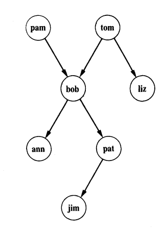

# Introduzione al Prolog

Prolog è un linguaggio con computazione simbolica e non numerica - si basa sul concetto di linguaggio di programmazione a paradigma dichiarativo nel quale non ci interessa spiegare il metodo risolutivo di un problema - ossia l'algoritmo - bensì si basa su relazioni e predicati.
### Esempio introduttivi

Possiamo creare una relazione tra diversi oggetti - nel seguente esempio possiamo creare un albero genealogico come il seguente:



Se vogliamo dire che tom è un genitore di bob possiamo scrivere:
``` Prolog
parent(tom,bob).
```

Questa si chiama *clausola* e dichiara una relazione un fatto sulle relazioni dell'albero.
```
parent( pam, bob). 
parent( tom, bob). 
parent( tom, liz). 
parent( bob, ann). 
parent( bob, pat). 
parent( pat, jim).
```

Una volta dichiarato l'albero possiamo porre dei quesiti a Prolog che ci risponderà - ad esempio gli possiamo chiedere bob è genitore di pat:
```
?- parent(bob, pat).
```

La risposta sarà **true** - possiamo ottenere anche **false** se la domanda che gli poniamo non è vera o se menzioniamo un elemento inesistente nel programma.

Possiamo porre anche delle domande più interessanti come - Chi è il genitore di liz?
```
?- parent(X, liz).
```

Prolog ci risponderà con $X=tom$ - e se invece volessimo sapere chi è il figlio di bob:
```
?- parent(bob, X).
```
La risposta sarà $X=ann$ - possiamo continuare a vedere tutte le possibili risposte (digitando ';') alla domande - quando saranno finite Prolog risponderà con **false.**

Proviamo a chiedere delle domande più complesse tipo: "Chi è genitore di chi" - formuliamo la domanda come - Trova X e Y tale che X è genitore di Y:
```
?- parent(X,Y).
```

Proviamo a chiedergli chi è il nonno di jim. Il programma non sa chi è in modo diretto il nonno - ma possiamo porgli una *query* in modo tale che lo comprenda - suddividiamo la domanda in due step:

1) Chi è il genitore di jim? Assumiamo che sia un Y.
2) Chi è il genitore di Y? Assumiamo sia una X.

```
?- parent(Y, jim), parent(X,Y).
```

La risposta sarà:

- X = bob
- Y = pat

Possiamo leggere la query come - trova un X e Y che soddisfa i seguenti requisiti:
```
?- parent(Y, jim) and parent(X,Y).
```
Cambiando l'ordine dei requisiti la logica rimane la stessa. Allo stesso modo possiamo chiedere chi sono i nipoti di un certo oggetto.

Altra domanda - ann e pat hanno un genitore in comune? - esprimiamola come:

1) Chi è il genitore X di ann?
2) E' X un genitore di pat?

``` Prolog
?- parent(X,ann),parent(X,pat).
```

Questo esempio ci ha fatto capire diverse cose sul Prolog:

- E' molto *facile definire delle relazioni*.
- Possiamo *questionare* Prolog sulle relazioni definite nel programma.
- Un programma Prolog consiste di *clausole.*
- Gli argomenti di una relazione possono essere *atomi* o *variabili*.
- Possiamo mettere in *sequenza* più domande per creane di più complesse.
- Una risposta può essere positiva o negativa.
- Se diverse risposta soddisfano la domanda allora Prolog le mostrerà tutte all'utente.
### Estensione dell'esempio introduttivo

Aggiungiamo delle relazioni *unarie* all'esempio svolto precedentemente:

``` Prolog
female(pam). %pam is female
male(tom). 
male(bob). 
female(liz). 
female(pat). 
female(ann). 
male(jim).
```

> Le relazioni **binarie** - come parent - definiscono relazioni tra coppie di oggetti - mentre quelle **unarie** dichiarano proprietà semplici (si/no).

> Possiamo scrivere quello sopra anche come una relazione binaria.

Creiamo adesso la relazione **offspring** - il contrario di parent. Potremmo essenzialmente dichiararla alla stessa maniera di parent - ma siccome abbiamo già dichiarato quest'ultima possiamo dichiarare offspring tramite degli *predicati logici:*

```Logic
Per ogni X e Y,
	Y è offspring di X se
	X è un parent di Y.
```

Il corrispondente in Prolog è:
``` Prolog
offspring(Y,X) :- 
	parent(X,Y).
```

Questo tipo di clausole si chiamano **regole** e sono diverse dai **fatti**.

> I fatti sono sempre veri - mentre le regole sono vere solo sotto certe condizioni.

Quindi le regole hanno:

- Una parte condizionale - il corpo della regola o *body.*
- Una conclusione - la testa.

Se la condizione di parent è vera allora una consequenza logica è offspring.

Creiamo altre regole come - **mother** - **grandparent** - **sister**
```
Per ogni X e Y,
	X è mother di Y se
	X è un parent di Y e
	X è female

%%%%%%%%%%%%%%%%%%%%%%%%%

mother(X,Y) :-
    parent(X,Y), %%La virgola equivale all'AND logico.
    female(X).
    
%%%%%%%%%%%%%%%%%%%%%%%%%

grandparent(X,Z) :-
    parent(X,Y),
    parent(Y,Z).

%%%%%%%%%%%%%%%%%%%%%%%%%

sister(X,Y) :-
	parent(Z,X),
	parent(Z,Y), %%Z deve essere genitore di entrambi
	female(X).
```

Nell'ultima regola succede qualcosa di strano quando chiediamo:
```
?- sister(X, pat)
```

Prolog troverà due risposte - la prima è ann - la seconda è pat. Quindi pat è sorella di se stessa che è ovviamente sbagliato - ma da un punto di vista del Prolog - per come abbiamo definito la regola è giusto.
Per riuscire ad evitare questo errore dobbiamo aggiungere una nuova regola **different** che è soddisfata se X e Y sono diversi.

> Prolog è formato da tre tipi di clausole: Fatti - Regole - Domande.

---
### Regola definita per ricorsione

Proviamo a creare una regola per i predecessori:
```
%For all X and Z
%    X is a predeccesor of Z if
%    X is a parent of Z

predecessor(X,Z):-
	parent(X,Z).
```

Questa regola funziona solo per i predecessori diretti - come possiamo implemetarne una che funzioni per ogni predecessore. Potremmo mettere tante clausole parent quanto l'altezza del nostro albero - ma verebbe fuori un programma lungo - complesso e poco funzionale.

Esiste una formulazione corretta e fuzionante - l'idea è quella di definire predecessor tramite se stessa.
```
For all X and Z. 
	X is a predecessor of Z if 
	there is a Y such that 
	(1) X is a parent of Y and 
	(2) Y is a predecessor of. Z.

%%%%%%%%%%%%%%%%%%%%%%%%%%%%%%%

predecessor(X,Z):-
	parent(X,Z).

predecessor(X,Z) :-
	parent(X,Y),
	predecessor(Y,Z).
```

Abbiamo scritto un programma per la relazione predecessor composto da due regole - la prima per trovare i predecessori diretto - la seconda quelli indiretti.
Nella formulazione abbiamo usato la regola per definire se stessa - questo tipo di definizione sono dette **ricorsive**.

Le due clausole assieme formano la clausola predecessor - quindi invece di chiamarle clausole chiamiamo l'insieme delle due *procedura*.

---
### Paradigma dichiarativo e procedurale

Esistono diversi tipi di programmazione - quello che ci interessa nella seconda parte di questo corso è quella **dichiarativa**

> **Programmazione Dichiarativa:** E' un paradigma di programmazione secondo cui la logica della computazione è espressa senza il *controllo di flusso.*

Nell'esempio che abbiamo mostrato sopra ci siamo interessati solo ai risultati del programma senza capire **come** il sistema trova la soluzione.

Nella *parte dichiarativa* di Prolog ci interessa solo come venfono **definite le relazioni** tra le entità. Essenzialemente ci chediamo *cosa* sarà l'output del programma. Nella *parte procedurale* ci interessa il modo in cui si arriva alle soluzioni.

> Vantaggio del Prolog è quello di 'nascondere' la parte procedurale - incoraggiando il programmatore a pensare solo in maniera dichiarativa.

---
### Programmazione Procedurale

Gli elementi principali della programmazione procedurale sono:

- Variabili - Spazio di memoria con un nome che hanno come attività principale quella di assegnamento di un valore alla variabile.

- Algoritmi - fatti da sequenze di istruzione atte a risolvere un problema.

- Funzioni che possono essere Ricorsive e danno un risultato.

---
### Programmazione Dichiarativa

Gli elementi che ci interessano sono:

- Variabili 
- Incognita 
- Unificazione.

> Unificazione significa che una variabile avrà sempre lo stesso valore in un determinato contesto è non lo può cambiare.

Esiste un equivalente delle funzioni che si basa sull'idea dell'**induzione.**

> Devo quindi dimostrare il caso base, suppore che la tesi sia vera e quindi dimostrare il caso $n+1$. Quindi cerchiamo un legame tra $P(n)$ e $P(n+1)$. $P(n+1) = n+1 +P(n)$ 

Programmare per induzione significa scrivere la relazione che ci sta tra qualcosa di più grande e le sue sotto parti. Un parallelo alla ricorsione è l'induzione che nel caso specifico la chiamiamo **strutturale**, perché *non lavora solo su interi, ma su strutture.*

---
### Induzione strutturale

Deve essere applicata a strutture grandi secondo le loro sotto parti. prendiamo in esempio un grafo. Ogni nodo hanno delle etichette associate al nodo - che possono essere usate come identificati per nodi - ma le etichette devono essere diverse - non succede sempre -  questo è un esempio.

> Nota: Etichette $\neq$ Identificatori  

Vogliamo trovare il percorso Path(x, y) tra due nodi conoscendo il concetto di arco edge(x, y).

**Passo Base**: Esiste un percorso tra x e y se di base esiste un arco tra x e y.
**Passo Induttivo**:  Esiste un percorso se esiste un punto medio tra x e y - quindi se esiste un punto medio esiste un percorso tra x e y se esiste un percorso tra x e Z e tra Z e y.

>Z è il punto medio.


Questa idea si chiama **induzione strutturale** - cioè definiamo la proprietà di una struttura usando le proprietà delle sotto strutture.

> Non è l'unico modo per risolvere il problema. Basti pensare che se esiste un percorso se esiste un punto medio tra x e y - quindi se esiste un punto medio esiste un percorso tra x e y se esiste un percorso tra x e Z e un arco Z e y.