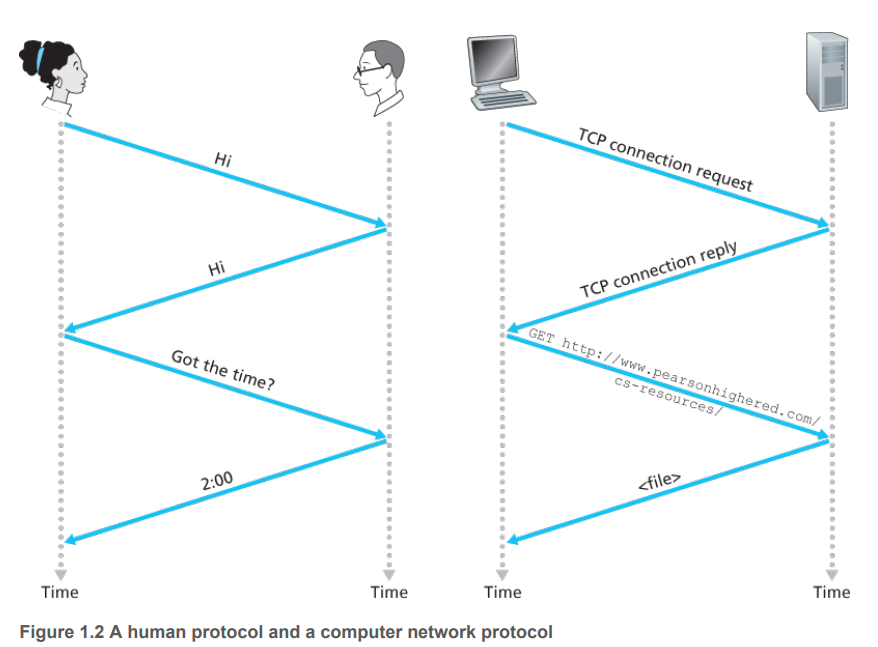
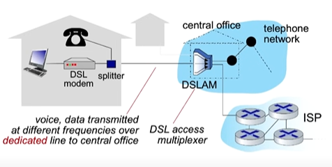
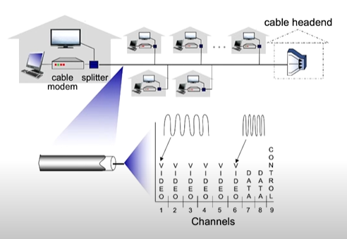
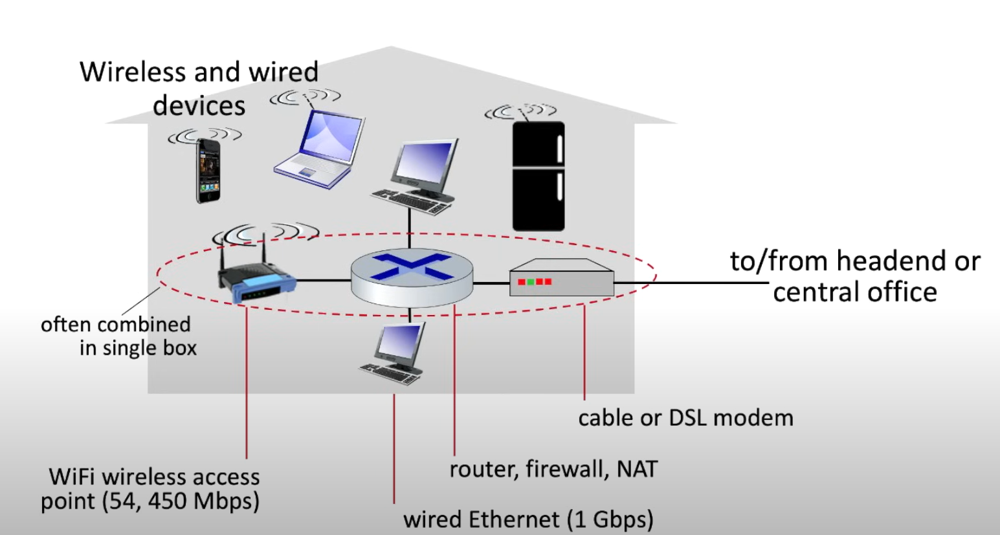
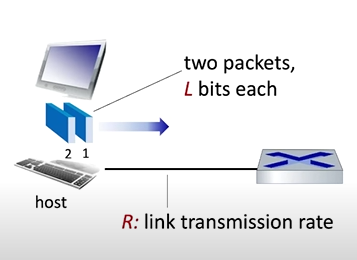

# Capitolo 1 - Reti di computer e Internet

### Cos'è Internet 
---

**Internet come un insieme di dispositivi:**

Internet è una rete di computer composta da miliardi di dispositivi chiamati **host** o **end system**, notiamo anche che la terminologia di rete di computer è outdated considerando i migliaglia di dispositivi connessi ad Internet che non sono dei PC desktop. Gli host sono i **nodi** della rete su cui girano le applicazioni.
Il modo in cui gli host comunicano è tramite dei **packet switches**, il loro compito è quello specificare il percorso che i pacchetti (Insiemi di informazioni) devono prendere per arrivare a destinazione.
Infine abbiamo i **communication links**, ne esistono di diversi tipi e hanno il compito di trasferire informazioni fra gli host e i packet swithces. La **velocità di trasmissione** è misurata in *bits/second*.
Un insieme di device, packet switches e communication links si chiama **rete**, mentre la sequenza di comunicazione fatte per portare un pacchetto a destinazione si chiama **route**.
Possiamo quindi dire che Internet è una **rete composta da reti**. Ogni end system accede ad Internet tramite un **Internet Service Provider (ISP)**.

Le comunicazioni tramite gli host avvengono tramite dei **protocolli**, i quali descrivono una maniera standardizzata per far si che dispositivi su reti diverse possano comunicare senza problemi. Questi standard sono definiti dalla **IETF (Internet Engineering Task Force)** e i documenti standard sono chiamati **RFC (Requests for comments).**

---
**Internet come un infrastruttura che fornisce servizi ad applicazioni:** 

I servizi possono essere: web, email, giochi, e-commerce e molti altri. Queste applicazioni si dicono **applicazioni distribuite**, cioè che involvono molti end system che si scambiano informazioni. Queste applicazioni vengono eseguite sugli end system e 'siedono' ad un livello superiore rispetto alla rete.

Inoltre gli end system attaccati ad Internet forniscono delle **interfacce socket** che specificano il modo in cui l'applicazione eseguita sull'end system chiede all'infrastruttrura Internet di spedire messaggi ad un altro specifico end system o programma di destinazione.

---
Prima abbiamo parlato di protocolli, cerchiamo di dare una definizione su che cosa fanno:

>Un protocollo definisce il **formato**, **l'ordine** dei messaggi mandati e ricevuti fra entità all'interno di una rete e le **azioni** che vengono svolte durante la ricezione o la trasmissione dei messaggi.

### Network edge

Un nodo della rete, cioè un host, può essere distinti in:

- **Client** - Riceve servizi.
- **Server** - Solitamente si trovano nei data center e hanno il compito di offrire servizi.

 Consideriamo adesso la **rete di accesso**, cioè la rete che connette fisicamente un end system al primo router (**Edge router).** Esistono diversi tipi di reti di accesso divisibili in: 

- Reti ad accesso residenziale;
- Reti ad accesso istituzionale;
- Reti ad accesso mobile;

Oggi, i due tipi di accesso a banda larga residenziale più diffusi sono la **Digital Subscriber Line** (DSL) e **tramite cavo.**

---
**Accesso tramite DSL:**

> L'accesso ad Internet tramite DSL viene fornito dalla stessa compagnia telefonica che fornisce i cavi del telefono per i trasferimenti di dati. Quindi i modem degli utenti della rete usano la linea telefonica (**doppino telefonico**) per collegarsi ad un **DSLAM**.

Il modem DSL prende i dati digitali e li trasforma in analogici ad alta frequenza, questi vengono inviati attraverso i cavi alla centrale e poi vengono convertiti di nuovo in digitali quando arrivano al DSLAM.
La linea telefonica di casa porta sia i dati di Internet che i segnali telefonici tradizionali, ma questi vengono condificati a frequenze diverse:

- Una banda ad **alta velocità** per i dati in arrivo (da 50 kHz a 1 MHz).
- Una banda a **velocità media** per i dati in uscita (da 4 kHz a 50 kHz).
- La banda **tradizionale** per la telefonia (da 0 a 4 kHz).

Questo sistema permette di **usare la stessa linea telefonica** per fare una telefonata e per connettersi a Internet **contemporaneamente**, come se fossero tre collegamenti separati. Per fare in modo che i segnali non si mescolino, un "**splitter**" a casa divide i segnali telefonici e i dati, inviando quelli dati al modem DSL. Nella centrale, il DSLAM separa anche i segnali per mandarli dove devono andare: i dati vanno a Internet e le chiamate telefoniche continuano a viaggiare sulla linea telefonica. Molte case possono connettersi a un singolo DSLAM, permettendo così una **connessione condivisa tra molte abitazioni.**

---
**Accessi tramite cavo:**

Negli accessi tramite cavo, abbiamo un cavo fisico che connette diverse case ad un unico *fine* di cavo. I segnali che vengono mandati su questo cavo sono a **frequenze diverse.**
Per evitare che segnali a frequenze diverse si vadano ad intralciare si utilizza un *frequency division multiplexing (FDM).* (Ovviamente le stesse frequenze **condividono** lo stesso cavo quindi bisogna trovare un modo per gestirle, lo vederemo nei capitoli succesivi).

Questi tipo di rete è anche chiamato **Hybrid fiber coax (HFC)**, cioè che combina fibra ottica e cavo coassiale.

---
Entrambi i tipi di rete di cui abbiamo parlato sono **assimetrici**, cioè abbiamo una differenza nella velocità di **downstream** e **upstream**, questa differenza è dovuta dal fatto che in entrambi i casi ci interessa essere dei client - quindi ricevere molti più dati rispetto ad inviarli.

| Tipo di rete | Velocità in downstream | Velocità in upstream |
| -------------| -----------------------|----------------------|   
| Cavo         | 40Mbps - 1.2GBps       | 30 - 100 Mbps        | 
| DSL          | 24 - 53Mbps            | 3.5 - 16Mbps         |

>Nel DSL la velocità di trasmissione dipende molto dalla distanza dall'ufficio centrale.

Guardando nello specifico un rete di una casa troveremo quindi: Un **cavo o un modem DSL**, connesso al modem abbiamo un **router** che connessione con e senza cavo ai dispositivi della casa, quindi il router sarà connesso a dispositivi tramite cavo (*wired Ethernet* - 1 Gbps) oppure ad un **access point** per il WiFi wireless (54 - 450 Mbps).

>Solitamente modem, router e access point sono posizionati nella stessa scatola.

---
**Wireless network**

Abbiamo già parlato di reti wireless all'interno di una casa, cerchiamo di capire meglio di cosa si tratta. Esistono due tipi di reti senza cavo:

- **Wireless local area networks** - WiFi
- **Wide-area cellular access networks** - 3G, 4G, 5G

In entrambi i casi abbiamo un *access point*, cioè un posto da cui gli end system possono mandare e ricevere dati.
Di seguito alcune reti senza cavo più usate:

**Wireless local area networks (WLAN):** Sono reti che si trovano all'interno di case o aziende, lavorano in un raggio di circa 10 - 100 metri e la velocità di trasmissione è circa: 11, 54 o 540Mbps.
Questi protocolli sono standardizzati dalla **IEEE** nella famiglia delle tecnologie 802.11, consociute come tecnologie WiFi.

**Wide-area cellular access networks:** Sono reti che vengono **fornite dagli operatori delle rete mobile e cellulare**, la velocità di trasmissione è sulle decine di Mbps. Al momento ci troviamo alla quarta generazione (4G) - è in sviluppo amche il 5G.

**Enterprise network:** Sono come le home network, ma consistono in un insieme di diverse tecnologie, quindi sia ethernet - (100Mbps, 1Gbps, 10Gbps) - che senza cavo. La differenza principale rispetto alle home network è la **maggiore quantità di router e switches** usati per dirigere grandi quantità di pacchetti.

**Data center network:** Sono un tipo particolare di Enterprise network, ma sono molto più potenti, poichè connettono **centinaia di server insieme e diretti ad Internet.** 

Con questo abbiamo finito la visione generale sui vari tipi di reti di accesso, adesso controlliamo cosa significa **inviare dei pacchetti su una rete** quali sono i **dispositivi fisici** con il quale possiamo inviare i pacchetti.

---
**Inviare pacchetti sulla rete**

Immaginiamo di avere un host che deve spedire un file ad un end system, il modo in cui questa trasmissione avviene è semplice:

1) Si prende il messaggio che si vuole spedire.
2) Si divide il messaggio in piccoli *chunk* - cioè i **pacchetti** - ognuno di $L$ bits.

>All'interno di ogni pacchetto abbiamo anche delle informazioni aggiunte contenute in un **header**, le informazioni dell'header dipendono dal protocollo che effettua la trasmissione.

3) I pacchetti sono inviati sulla rete di accesso ad **tasso di trasmissione** $R$.

>Possiamo considerare $R$ come la **capacità** oppure la **larghezza di banda della connessione.** Inoltre: $$
\text{Ritardo di trasmissione} = \frac{L \, (\text{bits})}{R \, (\text{bits/sec})} $$
>Il ritardo di trasmissione è il tempo necessario per spedire pacchetti da $L$ bits nella rete.

---
**Caratteristiche fisiche della trasmissione dei dati**

Sappiamo che i bit vengono propagati tra coppie di ricevitori e mandanti, la **connessione fisica** è il mezzo con la quale si possono spedire bit. Li possiamo dividere in:

- **Mezzi guidati - Guided media**: Trasmettono segnali tramite dei mezzi fisici.
- **Mezzi non guidati - Unguided media**: I segali vengono propagati liberamente.

Di seguito alcuni tipi di mezzi di comunicazione più usati:

**Twisted pair (TP):** Sono due **fili di rame intrecciati** - inizialmente facevano riferimento solo alla linea telefonica - oggi invece si riferiscono anche all'ethernet o adsl, il tasso di trasmissione è nell'ordine di centinaia di Mbps fino a centinaia di Gbps. Sono suscettibili a rumori elettromagnetici.

**Cavo coassiale:** Sono due conduttori fatti di rame, ma sono **concetrici** e non paralleli. Con le giuste protezioni possono raggiungere tassi di trasmissione molto elevati e possono avere **diversi canali con diverse frequenze.**
>I primi cavi ethernet funzionavano tramite cavi coassiali.

**Cavi in fibra ottica:** Sono fibre di vetro che trasmettono impulsi di luce - ogni impulso equivale ad un bit - lavorano su velocità di trasmissione elevatissime ed hanno un tasso di errore molto basso rispetto ai mezzi visti precedentemente - sono anche immuni a rumori elettromagetici. Vengono usate per comunicazioni molto distanti, ma hanno come problema il costo elevato.

**Wireless radio:** I segnali vengono trasportati in diverse *bande* dello spettro elettromagetico, quindi non ci sta nessun cavo. I segnali vengono trasferiti in **broadcast**, quindi tutti i dispositivi nel raggio di azione possono intercettarli.
Il problema principale sono gli effetti che ha l'ambiente circostante sui segnali, questi infatti possono essere: **riflessi, bloccati da oggetti, essere intercettati creando rumore.**
Esistono diversi tipi di segnali radio wireless, sono molto complicati da ottenere, alcuni sono:

- **Wireless LAN (WiFi)** - Decine di metri con velocità sui 10 - 100 Mbps.
- **Wide-Area** - Decine di Mbps su svariati Km.
- **Bluetooth** - Piccole distanze con tasso di trasmissione limitato.
- **Microonde terrestri** - Comunicazioni punto-punto con canali a 45 Mbps.
- **Satelliti** - Fino a 45 Mbps con ritardi end to end di 270msec. 
