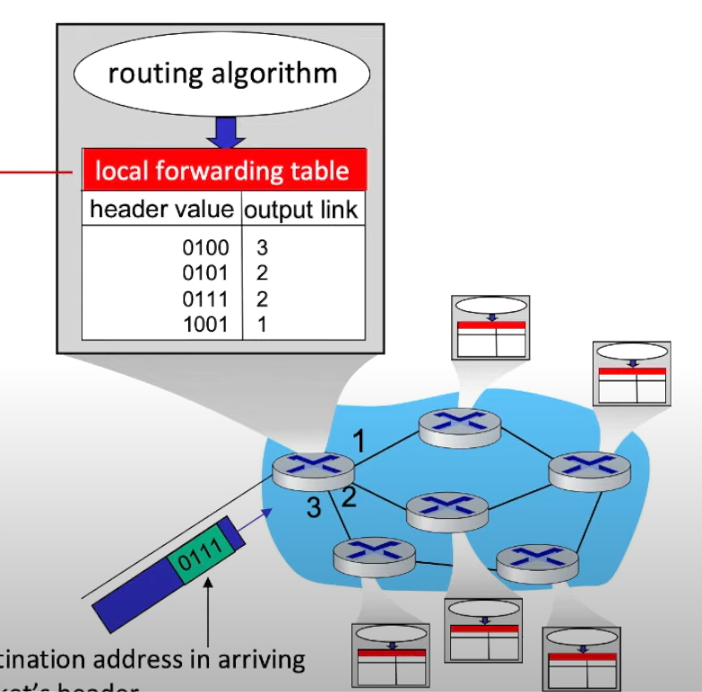
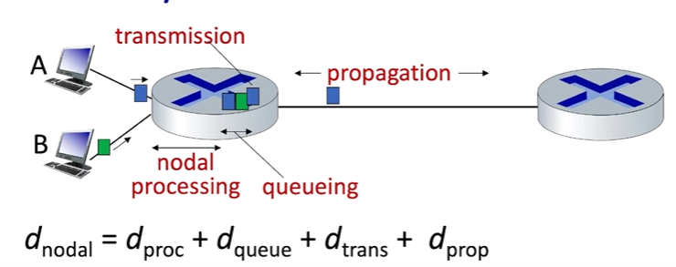
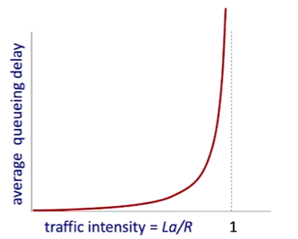
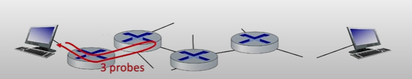
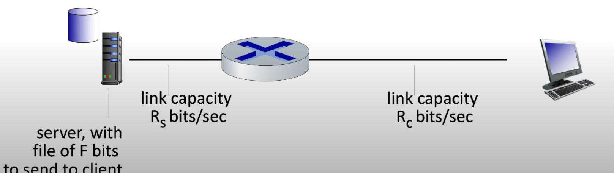
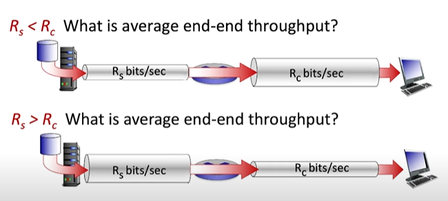
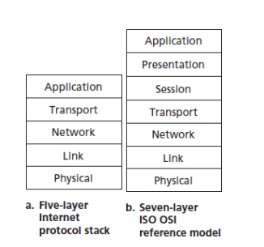
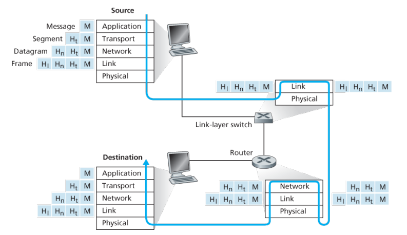

# Capitolo 1 - Reti di computer e Internet

### Cos'è Internet 
---

**Internet come un insieme di dispositivi:**

Internet è una rete di computer composta da miliardi di dispositivi chiamati **host** o **end system**, notiamo anche che la terminologia di rete di computer è outdated considerando i migliaglia di dispositivi connessi ad Internet che non sono dei PC desktop. Gli host sono i **nodi** della rete su cui girano le applicazioni.
Il modo in cui gli host comunicano è tramite dei **packet switches**, il loro compito è quello specificare il percorso che i pacchetti (Insiemi di informazioni) devono prendere per arrivare a destinazione.
Infine abbiamo i **communication links**, ne esistono di diversi tipi e hanno il compito di trasferire informazioni fra gli host e i packet swithces. La **velocità di trasmissione** è misurata in *bits/second*.
Un insieme di device, packet switches e communication links si chiama **rete**, mentre la sequenza di comunicazione fatte per portare un pacchetto a destinazione si chiama **route**.
Possiamo quindi dire che Internet è una **rete composta da reti**. Ogni end system accede ad Internet tramite un **Internet Service Provider (ISP)**.

Le comunicazioni tramite gli host avvengono tramite dei **protocolli**, i quali descrivono una maniera standardizzata per far si che dispositivi su reti diverse possano comunicare senza problemi. Questi standard sono definiti dalla **IETF (Internet Engineering Task Force)** e i documenti standard sono chiamati **RFC (Requests for comments).**

---
**Internet come un infrastruttura che fornisce servizi ad applicazioni:** 

I servizi possono essere: web, email, giochi, e-commerce e molti altri. Queste applicazioni si dicono **applicazioni distribuite**, cioè che involvono molti end system che si scambiano informazioni. Queste applicazioni vengono eseguite sugli end system e 'siedono' ad un livello superiore rispetto alla rete.

Inoltre gli end system attaccati ad Internet forniscono delle **interfacce socket** che specificano il modo in cui l'applicazione eseguita sull'end system chiede all'infrastruttrura Internet di spedire messaggi ad un altro specifico end system o programma di destinazione.

---
Prima abbiamo parlato di protocolli, cerchiamo di dare una definizione su che cosa fanno:

>Un protocollo definisce il **formato**, **l'ordine** dei messaggi mandati e ricevuti fra entità all'interno di una rete e le **azioni** che vengono svolte durante la ricezione o la trasmissione dei messaggi.

### Network edge

Un nodo della rete, cioè un host, può essere distinti in:

- **Client** - Riceve servizi.
- **Server** - Solitamente si trovano nei data center e hanno il compito di offrire servizi.

 Consideriamo adesso la **rete di accesso**, cioè la rete che connette fisicamente un end system al primo router (**Edge router).** Esistono diversi tipi di reti di accesso divisibili in: 

- Reti ad accesso residenziale;
- Reti ad accesso istituzionale;
- Reti ad accesso mobile;

Oggi, i due tipi di accesso a banda larga residenziale più diffusi sono la **Digital Subscriber Line** (DSL) e **tramite cavo.**

---
**Accesso tramite DSL:**

> L'accesso ad Internet tramite DSL viene fornito dalla stessa compagnia telefonica che fornisce i cavi del telefono per i trasferimenti di dati. Quindi i modem degli utenti della rete usano la linea telefonica (**doppino telefonico**) per collegarsi ad un **DSLAM**.

Il modem DSL prende i dati digitali e li trasforma in analogici ad alta frequenza, questi vengono inviati attraverso i cavi alla centrale e poi vengono convertiti di nuovo in digitali quando arrivano al DSLAM.
La linea telefonica di casa porta sia i dati di Internet che i segnali telefonici tradizionali, ma questi vengono condificati a frequenze diverse:

- Una banda ad **alta velocità** per i dati in arrivo (da 50 kHz a 1 MHz).
- Una banda a **velocità media** per i dati in uscita (da 4 kHz a 50 kHz).
- La banda **tradizionale** per la telefonia (da 0 a 4 kHz).

Questo sistema permette di **usare la stessa linea telefonica** per fare una telefonata e per connettersi a Internet **contemporaneamente**, come se fossero tre collegamenti separati. Per fare in modo che i segnali non si mescolino, un "**splitter**" a casa divide i segnali telefonici e i dati, inviando quelli dati al modem DSL. Nella centrale, il DSLAM separa anche i segnali per mandarli dove devono andare: i dati vanno a Internet e le chiamate telefoniche continuano a viaggiare sulla linea telefonica. Molte case possono connettersi a un singolo DSLAM, permettendo così una **connessione condivisa tra molte abitazioni.**

---
**Accessi tramite cavo:**

Negli accessi tramite cavo, abbiamo un cavo fisico che connette diverse case ad un unico *fine* di cavo. I segnali che vengono mandati su questo cavo sono a **frequenze diverse.**
Per evitare che segnali a frequenze diverse si vadano ad intralciare si utilizza un *frequency division multiplexing (FDM).* (Ovviamente le stesse frequenze **condividono** lo stesso cavo quindi bisogna trovare un modo per gestirle, lo vederemo nei capitoli succesivi).

Questi tipo di rete è anche chiamato **Hybrid fiber coax (HFC)**, cioè che combina fibra ottica e cavo coassiale.

---
Entrambi i tipi di rete di cui abbiamo parlato sono **assimetrici**, cioè abbiamo una differenza nella velocità di **downstream** e **upstream**, questa differenza è dovuta dal fatto che in entrambi i casi ci interessa essere dei client - quindi ricevere molti più dati rispetto ad inviarli.

| Tipo di rete | Velocità in downstream | Velocità in upstream |
| -------------| -----------------------|----------------------|   
| Cavo         | 40Mbps - 1.2GBps       | 30 - 100 Mbps        | 
| DSL          | 24 - 53Mbps            | 3.5 - 16Mbps         |

>Nel DSL la velocità di trasmissione dipende molto dalla distanza dall'ufficio centrale.

Guardando nello specifico un rete di una casa troveremo quindi: Un **cavo o un modem DSL**, connesso al modem abbiamo un **router** che connessione con e senza cavo ai dispositivi della casa, quindi il router sarà connesso a dispositivi tramite cavo (*wired Ethernet* - 1 Gbps) oppure ad un **access point** per il WiFi wireless (54 - 450 Mbps).

>Solitamente modem, router e access point sono posizionati nella stessa scatola.

---
**Wireless network**

Abbiamo già parlato di reti wireless all'interno di una casa, cerchiamo di capire meglio di cosa si tratta. Esistono due tipi di reti senza cavo:

- **Wireless local area networks** - WiFi
- **Wide-area cellular access networks** - 3G, 4G, 5G

In entrambi i casi abbiamo un *access point*, cioè un posto da cui gli end system possono mandare e ricevere dati.
Di seguito alcune reti senza cavo più usate:

**Wireless local area networks (WLAN):** Sono reti che si trovano all'interno di case o aziende, lavorano in un raggio di circa 10 - 100 metri e la velocità di trasmissione è circa: 11, 54 o 540Mbps.
Questi protocolli sono standardizzati dalla **IEEE** nella famiglia delle tecnologie 802.11, consociute come tecnologie WiFi.

**Wide-area cellular access networks:** Sono reti che vengono **fornite dagli operatori delle rete mobile e cellulare**, la velocità di trasmissione è sulle decine di Mbps. Al momento ci troviamo alla quarta generazione (4G) - è in sviluppo amche il 5G.

**Enterprise network:** Sono come le home network, ma consistono in un insieme di diverse tecnologie, quindi sia ethernet - (100Mbps, 1Gbps, 10Gbps) - che senza cavo. La differenza principale rispetto alle home network è la **maggiore quantità di router e switches** usati per dirigere grandi quantità di pacchetti.

**Data center network:** Sono un tipo particolare di Enterprise network, ma sono molto più potenti, poichè connettono **centinaia di server insieme e diretti ad Internet.** 

Con questo abbiamo finito la visione generale sui vari tipi di reti di accesso, adesso controlliamo cosa significa **inviare dei pacchetti su una rete** quali sono i **dispositivi fisici** con il quale possiamo inviare i pacchetti.

---
**Inviare pacchetti sulla rete**

Immaginiamo di avere un host che deve spedire un file ad un end system, il modo in cui questa trasmissione avviene è semplice:

1) Si prende il messaggio che si vuole spedire.
2) Si divide il messaggio in piccoli *chunk* - cioè i **pacchetti** - ognuno di $L$ bits.

>All'interno di ogni pacchetto abbiamo anche delle informazioni aggiunte contenute in un **header**, le informazioni dell'header dipendono dal protocollo che effettua la trasmissione.

3) I pacchetti sono inviati sulla rete di accesso ad **tasso di trasmissione** $R$.

>Possiamo considerare $R$ come la **capacità** oppure la **larghezza di banda della connessione.** Inoltre: $$\text{Ritardo di trasmissione} = \frac{L \, (\text{bits})}{R \, (\text{bits/sec})}$$
>Il ritardo di trasmissione è il tempo necessario per spedire pacchetti da $L$ bits nella rete.

---
**Caratteristiche fisiche della trasmissione dei dati**

Sappiamo che i bit vengono propagati tra coppie di ricevitori e mandanti, la **connessione fisica** è il mezzo con la quale si possono spedire bit. Li possiamo dividere in:

- **Mezzi guidati - Guided media**: Trasmettono segnali tramite dei mezzi fisici.
- **Mezzi non guidati - Unguided media**: I segali vengono propagati liberamente.

Di seguito alcuni tipi di mezzi di comunicazione più usati:

**Twisted pair (TP):** Sono due **fili di rame intrecciati** - inizialmente facevano riferimento solo alla linea telefonica - oggi invece si riferiscono anche all'ethernet o adsl, il tasso di trasmissione è nell'ordine di centinaia di Mbps fino a centinaia di Gbps. Sono suscettibili a rumori elettromagnetici.

**Cavo coassiale:** Sono due conduttori fatti di rame, ma sono **concetrici** e non paralleli. Con le giuste protezioni possono raggiungere tassi di trasmissione molto elevati e possono avere **diversi canali con diverse frequenze.**
>I primi cavi ethernet funzionavano tramite cavi coassiali.

**Cavi in fibra ottica:** Sono fibre di vetro che trasmettono impulsi di luce - ogni impulso equivale ad un bit - lavorano su velocità di trasmissione elevatissime ed hanno un tasso di errore molto basso rispetto ai mezzi visti precedentemente - sono anche immuni a rumori elettromagetici. Vengono usate per comunicazioni molto distanti, ma hanno come problema il costo elevato.

**Wireless radio:** I segnali vengono trasportati in diverse *bande* dello spettro elettromagetico, quindi non ci sta nessun cavo. I segnali vengono trasferiti in **broadcast**, quindi tutti i dispositivi nel raggio di azione possono intercettarli.
Il problema principale sono gli effetti che ha l'ambiente circostante sui segnali, questi infatti possono essere: **riflessi, bloccati da oggetti, essere intercettati creando rumore.**
Esistono diversi tipi di segnali radio wireless, sono molto complicati da ottenere, alcuni sono:

- **Wireless LAN (WiFi)** - Decine di metri con velocità sui 10 - 100 Mbps.
- **Wide-Area** - Decine di Mbps su svariati Km.
- **Bluetooth** - Piccole distanze con tasso di trasmissione limitato.
- **Microonde terrestri** - Comunicazioni punto-punto con canali a 45 Mbps.
- **Satelliti** - Fino a 45 Mbps con ritardi end to end di 270msec.

---
### The network Core

Abbiamo visto fino ad ora i nodi che si trovano ai vertici della rete, guardiamo adesso il cuore della rete. Il cuore è composto da un insieme di router che sono interconnessi tra di loro. Abbiamo già visto come gli end system si possono spedire pacchetti, ma non abbiamo menzionato che ogni pacchetto per arrivare a destinazione deve viaggiare attraverso dei **canali di comunicazione** e **packet switches.** la rete *inoltra* i pacchetti da un router all'altro attraverso i canali di comunicazione she creano il **percorso da sorgente a destinazione.** Esistono due principali *modalità di commutazione* per costruire una rete, basate sul **Packet switching o sul Circuit switching.**

---
**Packet Switching (Commutazione a pacchetto)**

Ci sono due funzioni in particolare che il cuore della rete deve svolgere:

- **Forwading - Switching - Inoltrare**
- **Routing**

Controlliamo come è composto l'interno di un router per capire meglio di cosa trattano.

All'interno di ogni router abbiamo una tabella che viene fornita da un **algoritmo di routing**, questa tabella serve per decidere in quale canale di comunicazione inoltrare il pacchetto che sta arrivando. In base al valore del **valore di destinazione nell'header** il pacchetto è inoltrato in diversi canali. La differenza tra le due funzioni descritte è che il forwarding è un'operazione **locale** che consiste solo nel decide in quale canale muovere il pacchetto una volta che arriva ad un determinato router, il routing invece è **globale**, ha il compito di determinare il percorso da sorgente a destinazione.

Il ritardo di trasmissione è dato dal rapporto tra la grandezza dei pacchetti da inviare e la velocità del mezzo di comunicazione, ma prima di poter inviare nuovamente un pacchetto da un router dobbiamo aspettare che questo riceva l'intero paccheto, questa operazione si chiama **store-and-forward.**

Cosa succede se degli end system vogliono mandare dei pacchetti ad un router che poi li deve inoltrare ad altri end system, ma la velocità di trasmissione tra end system e router è molto maggiore rispetto a quella della rete di accesso? Semplicemente si forma una **coda.**

>Una coda si forma quando una quantità di lavoro arriva più velocemente rispetto al tempo che ci vuole per servirla.

Quando la velocità di arrivo dei pacchetti è maggiore rispetto a quella di trasmissione avviene che i pacchetti formano una coda, se arrivano troppi pacchetti succede che il buffer di memoria del router non riesce a mantenerli tutti, di conseguenza molti pacchetti andrebbero persi. Se la rete non controlla gli end system che mandano i pacchetti si possono creare queste situazioni poco convenienti.

---
**Circuit Switching (Commutazione a circuito)**

Tutto quello che abbiamo visto nella sezione precedente ricade nel **Packet Switching**, ma non è l'unico modo per muovere dati in una rete, basti pensare a come funzionano le reti telefoniche; queste infatti si basano su un tipo di struttura di commutazione chiamata **circuit switching.**

Il circuit switching si basa sull'idea di allocare delle risorse end-end riservate per delle chiamate fra sorgente e destinazione, queste sono risorse non condivise che garantiscono una connessione senza perdita di dati o formazioni di code. Il problema è che sono molto inefficienti, se la larghezza di banda non è usata dalla chiamata allora viene persa.

>La larghezza di banda rappresenta la "larghezza" del "canale" e quanto spazio ci sta per fare passare dei dati.

Il circuit switching può essere ottenuto in due modi:

- **Frequency Division Multiplexing (FDM):** Le frequenze elettromagnetiche sono divise in delle bande strette, ogni chiamata ha una sua banda che viene trasmessa al massimo della capacità della banda.

- **Time Division Multiplexing (TDM):** divide il tempo in piccole "fette" e assegna a ciascun flusso di dati una "fetta" di tempo specifica per inviare i suoi dati.

---
**Packet switching VS Circuit Switching**

Immaginiamo di trovarci in questa situazione, abbiamo una rete con $n$ possibili utenti la velocità di trasmissione è di 1Gb/s, ogni utente ha bisogno di 100Mb/s quando attivo e ogni utente è attivo il $10$% del tempo. Quale tipo di commutazione è meglio usare?

Circuit Switching: $10$ Utenti;

Packet Switching: $35$ Utenti --> La probabilità che 10 utenti lavorano contemporaneamente è di $0.04$%;

Si potrebbe quindi pensare di usare il packet switching in modo tale da avere molti utenti a discapito della perdità di pochi pacchetti (**Guadagno statistico del multiplexing del Packet Switching).**

Il packet switching è il vincitore, anche la telefonia moderna lo usa. E' comodo perché è perfetto per *dati bursty*, cioè per dati mandati in maniera occasionale, le risorse possono essere condivise ed è molto semplice da installare.
Il problema principale riguarda la possibilità di **congestione**, cioè la perdita di pacchetti dovuta ad un overflow del buffer di memoria del router, ma molti protocolli moderni prendono in considerazione questa situazione, trovando delle soluzioni al problema.

> In alcune situazioni è possibile creare delle reti che commutano tramite packet switching, ma usando un comportamento da circuit switching, ma è molto complesso.

---
**Struttura di Internet: Una rete di reti**

Gli host che si connettono ad Internet accedono tramite degli **Internet Service Provider (ISP)**, questi devono essere connessi in modo tale che due host possano comunicare.
Esistono diversi modi in cui possiamo connetterli:

- Possiamo connettere ogni *access ISP* fra di loro, ma è una soluzione troppo complicata: $O(n^2)$ connessioni, troppo difficile da scalare.

- Possiamo connettere ogni *access ISP* ad un *ISP di transito*, è come se avessimo una sottorete di ISP che ci permetto di connetterci a tutti gli ISP, può funzionare per reti più piccole e non globali, inoltre significa che ci dovrebbe essere un solo ISP.

- Siccome ci sono tanti ISP avremo tante sottoreti, queste comunicano tra di loro tramite degli **IXP (Internet Exchange Point)**, quando due sottoreti sono connesse direttamente allora avremo un **peering link.**

- Possiamo anche introddure degli ISP regionali che si pongono fra le reti d'accesso e gli ISP di transito, inoltre anche aziende di come google possono avere le loro reti globali.

Al centro dell'Internet avviamo delle reti molto grandi ben connesse, chiamate anche **Tier 1 commercial ISP** ed hanno una copertura a livello nazionale e internazionale. Allontanandoci abbiamo gli **IXP**, gli **ISP regionali** e poi le **reti d'accesso**.
In tutto questo ci sono anche i **contenti provider networks**, cioè reti privatre che connettono i loro data center ad'internet bypassando ISP regionali e di tier 1.

>**POP (Point Of Presence)**: è un **punto di accesso fisico** che un Internet Service Provider (ISP) utilizza per collegare i suoi utenti alla rete.

---
### Performance: Ritardi, perdite e throughput nelle reti Packet-Switched

Quando i pacchetti viaggiano da un nodo all'altro sono soggetti a dei ritardi, ogni pacchetto subisce **tipi diversi di ritardo** per ogni nodo del percorso, i principali ritardi sono:
$$
d_{nodal} = d_{proc} +d_{queue} +d_{trans}+d_{prop}
$$
- $d_{proc}:$ Nodal Processing --> Ritardi associati all'**inoltrazione** dei pacchetti, **controllo** della tabella, controllo dell'**integrità** del pacchetto. Ordine dei **microsecondi**.

- $d_{queue}:$ Queueing Delay --> Ritardi dovuti al tempo di attesa nella coda del pacchetto. Dipende quindi dal livello di **congestione** del router. 

- $d_{trans}:$ Transmission Delay --> Il tempo che ci vuole per **trasmettere tutti i pacchetti** di bit su un determinato mezzo di trasmissione. ($d_{trans} = L/R$).

- $d_{prop}:$ Ritardo di Propagazione --> Il tempo che impiega un bit per **passare per un mezzo di comunicazione.** ($d_{prop} = d/s$) dove $d$ è la lunghezza del mezzo fisico, mentre $s$ è la velocità di propagazione.

---
**Ritardi dovuto alle code (Più in dettaglio)**

Guardiamo più in dettaglio questi tipi di ritardo definendo:

- $a:$ Tempo medio di arrivo per un pacchetto.
- $L:$ Lunghezza del pacchetto (bits).
- $R:$ Larghezza di banda per il mezzo (Tasso di trasmissione dei bit).

Quindi: $$\frac{L*a}{R} = \frac{Tasso\;di\;arrivo\;dei\;bit}{Tasso\;di\;servizio\;dei\;bit} = Intensita'\;del\;traffico$$
Se questo rapporto si avvicina allo $0$ significa che i ritadi relativi alla coda sono brevi, più il valore si avvicina ad $1$ più aumenta il ritardo. Se il rapporto ha un valore maggiore di $1$ significa che arriva un quantità maggiore di lavoro rispetto a quello che si può svolgere.

---
**Traceroute**

I programmi di traceroute sono programmi che ci permetto di **misurare il ritardo** da una sorgente ad un router attraverso un percorso Internet end-end verso una destinazione.
Per ogni $i$:

- Il programma inoltra tre pacchetti che raggiungeranno il router $i$ sul percorso verso la destinazione. Ciascun pacchetto ha un valore $i$ definito come **time-to-live.**

- Il router $i$ manderà una risposta a ciascuno dei tre pacchetti.

- Il programma misura poi l'**intervallo tra la trasmissione e la risposta**.

Quindi ogni router riceverà tre pacchetti dal computer che fa la richiesta.

>Gli **RTT (Round Trip Time) delay** sono il tempo totale che impiega un pacchetto di dati per andare dalla sorgente alla destinazione e tornare indietro al mittente.

Nel contesto di **traceroute**, l'RTT rappresenta il tempo di andata e ritorno di ciascun pacchetto inviato dal programma al router.

Ovviamente in tutto questo dobbiamo considerare la possibilità di perdere alcuni pacchetti. I pacchetti persi comunque **possono essere trasmessi nuovamente** dal nodo che precede la scomparsa e dalla sorgente, ma a volte non è necessario ritrasmetterli. 

---
**throughput**

Il throughput è il tasso/velocità con cui i bit vengono inviati da un mittente ad un ricevitore, è misurato in bits/unità di tempo, è può essere:

- **Instantaneo** se calcolato in un dato punto nel tempo.
- **Medio** se calcolato su un lungo periodo di tempo.

>Il tempo medio di throughput è solitamente dato dalla velocità di trasmissione del collegamento con la **larghezza di banda minore** lungo il percorso di trasmissione, questo viene chiamato **bottleneck link (Collegamento strozzato).**

Questa idea vale anche per reti in cui abbiamo diversi collegamenti verso un unico router.

---
### Layer, Incapsulazione e modelli di servizio

Fino ad ora abbiamo descritto i vari elementi che servono per implementare una rete, ma dobbiamo ancora trovare un modo per organizzare tutti questi elementi in un'architettura comune.

L'idea dietro al modello organizzato delle reti è quello del **layering**, cioè creare una struttura basata su diversi strati - impilati come una **pila** - dove ogni strato serve a fornire un **servizio** e ad **implementare o supportare** gli strati adiacenti. Questa struttura ci permette di identificare chiaramenti tutte le componenti della rete e le relazioni tra le varie componenti, inoltre questo sistema è **modularizzato** - cioè se dobbiamo modificare uno strato non dobbiamo preoccuparci di dover modificare l'intera struttura. 

> L'Internet ha una struttura basata sul layering

---
**Internet Protocol Stack**

Quando presi insieme, i protocolli dei vari strati si chiamano **stack di protocollo**. Lo stack di protocollo di Internet si basa su cinque livelli:

- **Applicazione** - Supporta le applicazioni della rete come HTTP, SMTP, FTP, DNS.

- **Trasporto** - Trasporta messaggi del livello di applicazione tra **endpoints** che usano quella applicazione. I principali tipi di protocollo usati su questo livello sono TCP e UDP. La differenza tra i due consiste nel fatto che il primo fornisce un servizio **connection-oriented** alle applicazioni, quindi è **affidabile**, il secondo fornisce un servizio **connectionless** che al contrario del **TCP non fornisce controllo su pacchetti, flusso dei dati o controllo della congestione.**  Questi protocolli **incapsulano** i dati - aggiungendo altre informazioni - in **segmenti.**

- **Rete** - Responsabile della creazione del percorso tra sorgente e destinazione, incapsula i segmenti del livello di trasporto creando dei **datagrammi.** I protocolli usati in questo livello sono: **IP** e **Protocolli di routing.**

- **Dati** - Traferisce dati tra componenti della rete che sono vicini. Incapsula i datagrammi per creare dei dati chiamati **frame**. I protocolli principali sono: **Ethernet, 802.11 (WiFi), PPP.**

- **Fisico** - Ha il compito di trasportare fisicamente i bit all'interno del mezzo di comunicazione.

Ogni livello essezialmente aggiunge nuovi elementi - gli **header** - all'interno del messaggio originario. Questi servono per far si che la comunicazione avvenga in maniera corretta.

>Internet Protocol Stack non è l'unico protocol stack esistente, basti pensare al modello ISO/OSI composto da sette strati, i cinque del Internet Protocol Stack uniti ai livelli di **Presentazione e Sessione**. Il primo si occupa di come i **dati vengano rappresentati** e **formattati** per l'applicazione. Il suo obiettivo è garantire che i dati trasmessi tra le applicazioni siano **comprensibili**, anche se sono su computer diversi con formati diversi - quindi fornisce servizi come quelli di **compressione, crittografia e conversione di formato.** Il secondo serve a gestire il **dialogo** tra le applicazioni stabilendo una **sessione di comunicazione.** Gestisce la **sincronizzazione e il controllo del flusso dei dati**, assicurando che i dati arrivino nella sequenza giusta e gestendo la comunicazione bidirezionale tra due applicazioni.

>L'**incapsulamento** è il processo in cui i dati vengono "avvolti" in più strati di **informazioni di controllo** (chiamate **header**) mentre passano attraverso i vari livelli di una rete.

>Notiamo che gli switch e i router **non hanno bisogno di implementare tutti i livelli** dello stack, poiché a loro non interessa lavorare con i messaggi, ma solo con segmenti o datagrammi.

---
### Reti sotto attacco

Il campo della sicurezza di rete si occupa di come i malintenzionati possono **attacare le reti** e di come possiamo **difenderle**. Con il crecescere delle reti e dell'Internet, anche questo campo è cresciuto a sua volta e siccome non sappiamo ancora di preciso come funzionano le reti questo paragrafo verrà usato per descrivere i tipi di attacco più frequenti. 

---
**Malware installati sugli host tramite Internet**

Colleghiamo i dispositivi ad Internet per ricevere/inviare dati, ma non tutti i dati che consumiamo sono "buoni". Infatti ne esistono alcuni - noti come **malware** - che possono infettare i nostri dispositivi. Le azioni che effettuano sono gravi: **cancellare file** o **installare spyware** che raccolgono informazioni da mandare ai malintenzionati. Se il nostro host è compromesso potrebbe essere reclutato in una rete di host compromessi chiamata **botnet** controllata dai malintenzionati.

>Molti dei malware moderni sono **autoreplicanti**, cioè che una volta infettato un host cercano riferimenti riguardanti altri host. Questa caratteristica gli permette di diffondersi in maniera esponenziale.

---
**Attacchi ai server e all'infrastruttura di rete**

Molti degli attacchi che vengono fatti ricadono nella categoria di **negazione del servizio**     (**Dos** - *Denial of Service*). Questo attacco rende inutilizzabile un host o un'altra parte di una rete. Web server, DNS, posta elettronica possono essere tutti soggetti. Sono un tipo di attacco **comune** e li possiamo distinguere in tre categorie:

- *Attacchi alla vulnerabilità dei servizi:* Invio di **pochi messaggi ben costruiti** ad un'applicazione vulnerabile. Se viene inviata la sequenza corretta il servizio si interrompe.

- *Bandwidth flooding (Inondazione di banda):* Vengono inviati un **"diluvio" di pacchetti** all'host bersaglio, così tanti che il collegamento di accesso viene bloccato.

- *Connection flooding (Inondazione di connessioni):* L'attaccante stabilisce **molte connessioni TCP**, tutte queste connessioni ingorgano l'host che non è in grado di accetare le connessioni leggittime.

Prendiamo in considerazione il secondo tipo di attacco per dire due cose in più. Inanzitutto per poter causare danni ad una rete il numero di pacchetti inviato deve essere maggiore rispetto alla velocità di accesso alla rete. Se questa è molto grande allora una singola sorgente non è abbastanza - anzi un ruoter a monte potrebbe individuare subito l'host malevolo - quindi si preferisce usare più sorgenti - questo tipo di attacco si chiama **DDoS**, cioè *Distributed Denial of Service*.

---
**Analisi del traffico**

Molti utenti accedono ad Internet tramite dispositivi wireless - questo è molto comodo - ma crea una grave vulnerabilità alla sicurezza. Un **ricevitore passivo** - in prossimità di un trasmettitore wireless potrebbe ottenere una copia di ogni pacchetto trasmesso comprese infromazioni sensibili. Questo ricevitore passivo è detto **packet sniffer.** Questo funziona anche su **reti cablate con distribuzione dei pacchetti in broadcast.**
Se si riesce ad accedere al router di accesso di un istituzione si può installare uno sniffer che fa la copia di tutti i pacchetti. Siccome sono **passivi** - cioè non inviano pacchetti - i packet sniffer sono molto complicati da trovare, la migliore difesa contro gli analizzatori di pacchetti è costituita dalla **crittografia.**

---
**Mascheramento**

E' molto semplice riuscire a creare un pacchetto con un indirizzo sorgente, contenuto e indirizzo del destinatario. Ed è molto semplice immettere pacchetti in Internet con degli indirizzi sorgenti **"falsi"** in modo tale per spacciarsi per qulacun'altro. Questa tecnica si chiama **IP spoofing**. L'idea per risolvere il problema si tratta in un meccanismo - chiamato *end-point authentication* - che ha il compito di determinare con sicurezza se il messaggio arrivato ha avuto origine da dove supponiamo l'abbia ottenuta.

---
**Perchè Internet è cosi poco sicuro?**

Il motivo è che Internet è stato progettato su un modello di "gruppo di utenti mutuamente **fidati** collegati in una rete trasparente". In un modello del genere la sicurezza è scontata. Oggi Internet coinvolge molti utenti - che hanno bisogno di comunicare - ma che non si fidano tra di loro. A volte utenti potrebbero non fidarsi a vicenda e quindi preferire comunicazioni anonime o attraverso terze parti, altre volte invece non ci si fida dell'hardware, software o dell'etere attraverso cui comunicano.

>Ricorda che la comunicazione tra utenti mutuamente fidati **non è lo standard**, ma un'eccezione.

---
### Storia delle reti di calcolatori e Internet

In questa sezione faremo un breve sintesi sulla storia delle reti ed dell'Internet.

---
**1961 - 1972 - Sviluppo della commutazione a pacchetto**

Le reti di calcolatori odierne hanno origine nei primi anni '60. In questo periodo la rete telefonica rappresentava la rete di comunicazione predominante. Ricordiamo che - siccome la voce viaggia a velocità costante - la rete telefonica usava la commutazione di circuito.
Ma con la nascita dei primi calcolatori con sistemi operativi in **time-sharing** ci si è posta la domanda di come potere collegare i calcolatori in modo tale da essere **condivisi** da più utenti geograficamente distanti.
Tre diversi gruppi di ricerca cominciarono a lavorare sulla commutazione a pacchetto e sono i gruppi di:

- **Leonard Kelinrock** - 1961, 1964 - Usando la teoria delle code dimostrò l'efficacia dell'approccio a commutazione di pacchetto per sorgenti di traffico intermittenti.

- **Paul Baran** - 1964 - Uso della commutazione a pacchetto per traffico vocale militare sicuro.

- **Donald Davies** e **Roger Scantlebury**.

**Licklider e Lawrence Robert** inoltre portarono avanti il progetto di **ARPAnet**, cioè la prima rete a commutazione di pacchetto. Cominciarono man mano ad essere installati i primi commutatori di pacchetti - gli **IMP** - specialmente nelle università.
Nel 1972 ARPAnet aveva 15 nodi - fu oggetto di una dimostrazione pubblica sulle comunicazione dei computer quell'anno. Venne anche sviluppato il primo protocollo tra nodi ARPAnet - il **NCP** (*network-control protocol*). Lo stesso anno **Ray Tomlinson** reallizzò il primo programma di posta elettronica.

---
**1972 - 1980 - Reti proprietarie e internetworking**

ARPAnet era una rete singola chiusa - quindi per conunicare con un calcolatore ARPAnet bisognava essere collegato ad uno dei suoi IMP.
Nel frattempo vennero sviluppate altre reti di commutazione a pacchetto come:

- **ALOHAnet** - Rete a microonde che collegava le università delle isole Hawaii.

- **DARPA** - Rete satellitare a pacchetti.

- **Telenet** - Rete commerciale a commutazione di pacchetto di BBN.

- **Cyclades** - Rete francese a commutazione a pacchetto.

Anche reti time-sharing come **tymnet** e **GE Information Service**, ma anche **SNA** di IBM.
Nacque anche l'idea di *rete di reti* - cioè un'architettura complessiva di connessione delle reti. Questo lavoro fu svolto da **Vinton Cerf** e **Robert Kahn** che usarono il termine *internetting* per descrivere il loro lavoro.
Questi principi vennero implementati dal protocollo **TCP** che combinava una consegna dei dati in modo affidabile e in sequenza di ritrasmissione - tuttora parte di TCP - e con funzioni di inoltro - oggi effettuate da IP.
Ci si rese conto dell'importanza di un servizio inaffidabile e senza controllo di flusso per applicazioni quali telefonia che portarono alla separazione di IP e TCP - nonché allo sviluppo di **UDP**.

---
**1980 - 1990 - La proliferazione delle reti**

ARPAnet si stava espandendo sempre di più e gli anni '80 rappresentavano un momento di enorme espansione. Questa espansione era tale grazie agli sforzi delle università che volevano una rete in grado di far comunicare tutte le università. Venne fondata **CSNET** per collegare tutti i ricercatori che non avevano accesso ad ARPAnet.
ARPAnet si spostò dall'uso di **NCP** a **TCP/IP** come protocollo standard. E si cominciò a sviluppare anche il protocollo **DNS** - (*Domain Name System)* che aveva il compito di associare i nomi di Internet leggibili agli indirizzi a 32 bit di IP.
In parallelo allo svipullo di ARPAnet nacque in Francia il progetto **Minitel** che aveva l'obiettivo di portare la trasmissione di dati in tutte le case. Era essenzialemente una rete pubblica a commutazione di pacchetto tramite l'suo di modem a bassa velocità.
Il Minitel si trovava in gran parte delle case francesi dieci anni prima che la maggior parte degli americani avesse mai sentito parlare di Internet.

---
**Anni '90 - Esplosione di Internet**

L'evento principale di questo periodo è la nascita del **World Wide Web** che non solo portava Internet nelle case di tutti, ma svolgeva anche la **funzione di piattaforme** per applicazioni web.
Questo fu ideato al **CERN** da **Tim Berners-Lee**, inoltre insieme ai suoi collaboratori svilupparono le prime versioni di **HTML**, **HTTP**, **web server** e **browser**.
Nacquero i primi browser con interfaccia grafica come **netscape** che nel 1996 entrò in guerra con un browser sviluppato da Microsoft.
La seconda merà deigli anni novanta vide lo sviluppo di molti prodotti e servizi su Internet come:

- La posta elettronica.
- Il Web.
- La messaggistica istantanea con liste di contatti.
- Condivisione di file **peer-to-perr**, il cui precursore fu **Napster**.

Le prime due provenivano dalla comunità di ricerca, le altre da giovani intraprendenti.
dal 1995 al 2001 rappresentò una montagna russa per Internet sui mercati finanziari. Molte imprese Internet vennero quotate in borsa anche se non portavano guadagni effettivi. Infatti le quotazioni crollarono nel 2000-2001 e molte imprese fallirono. Quindi si stabilirono alcune aziende che furono i grandi vincitori nel settore Internet come: Microsoft, Cisco, Yahoo, eBay, Google e Amazon.

---
**Il nuovo millennio**

Nei primi due decenni del XXI secolo nessuna tecnologia ha trasformato la società quanto Internet. insieme agli smartphone connessi a Internet. E tuttora si stanno facendo passi avanti su tutti i fronti. I seguenti sviluppi meritano una particolare attenzione:

- **Accesso a Internet ad alta velocità anche da casa** - Tramite fibra ottica e 5G fixed wireless, che permettono la diffusione di video generati da utenti (Youtube), streaming video (Netflix) e videoconferenze multiutente (Skype).

- Le reti wireless permettono un **accesso costante e veloce a Internet e servizi basati sulla posizione** come Yelp, Tinder e Wiz. Inoltre dal 2011 i computer palamari hanno superato il numero di quelli fissi grazie alle loro capacità di connettersi liberamente a Internet.

- Le reti social hanno creato enormi reti di persone che li usano per scambiarsi messaggi. Attraverso le loro API le reti social on-line creano **piattaforme per nuove applicazioni di reti** quali i pagamenti e giochi distribuiti.

- I fornitori di servizio on-line come Google hanno installato le loro reti private estese che non solo connettono i loro data center distribuiti in tutto il mondo, ma sono anche usate per aggirare il più possibile Internet facendo **peering** con gli ISP di basso livello, in modo tale che le ricerche siano veloci come se i data center si trovassero sil computer personaledegli utenti.

- Aziende commerciali e università eseguono loro applicazioni in **'cloud'** in modo tale da fornire applicazioni scalabili, permettere ambienti di memorizzazione e un'accesso implicito alle loro reti private ad alte prestazioni.

---
### Conclusioni capitolo

Con questo finisce il primo capitolo del corso di reti di calcolatori. Tutte queste idee le andremo a rivedere nello specifico nei prossimi capitoli.
