# Capitolo 2 - Livello di applicazione

Le applicazioni sono il motivo principale per cui abbiamo bisogno delle reti. Senza applicazioni utili o funzionale sarebbe inutile farle comunicare. I protocolli usati a questo livello - come **HTTP** - sono semplici da comprendere per l'uomo.

> Una cosa particolare è che molte applicazioni molto usate - social network, e-mail, voice over IP e molte altre - sono state sviluppate dopo la nascita dell'Internet. 

---
### Principi delle applicazioni di rete

Immagina di volere create un'applicazione che permetta la comunicazione tra end system - avendo visto tutti i livelli della rete - potremmo immaginare che sia un qualcosa di molto complicato. In realtà è molto più semplice di quello che sembra. Infatti dovremmo soltanto preoccuparci di due cose:

- **I protocolli forniti dal livello di trasporto** - gestiranno la comunicazione.

- **Le API che *nasconderanno* il livello di trasporto** - Permettono di interagire con la rete senza essere a conoscenza degli elementi del nucleo.

Quindi lo sviluppatore deve stabilire l'**architettura dell'applicazione** - completamente separata dall'archittetura della rete - questa fornisce alle applicazione uno specifico insieme di servizi. Esistono due tipi principali di archittetura dell'applicazione:

- **Client-Server**
- **peer-to-peer (P2P)**

Nel primo modello abbiamo un client e un server; Il *server* si trova sempre su un host attivo della rete - con un indirizzo **IP permanente** e solitamente si trova all'interno di data center - per ragioni di scalabilità. Il suo compito è quello di rispondere alle richieste dei client.
I client invece dovranno comunicare tra di loro **tramite server** e potrebbero avere degli indirizzi IP dinamici. (Ex: HTTP).

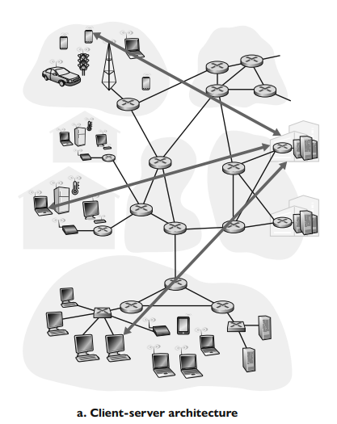

Nel secondo modello non abbiamo server - ma **peers** - cioè coppie di host - questi **comunicano direttamente tra di loro** e sono essenzialmente degli end-system che fanno richieste e forniscono servizi fra di loro. Uno dei punti di forza è la sua **scalabilità** - perchè ogni peer aggiunge sia carico di lavoro che capacità di servizio del sistema. Sono economiche - ma la gestione è molto complessa - anche da un punto di vista di sicurezza.

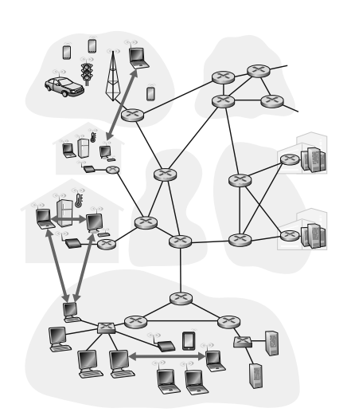

---
**Processi comunicanti**

Dobbiamo capire com fanno le applicazioni su host diversi a comunicare. Quando abbiamo un programma che gira su host possiamo riferirci ad esso come **processo.** Abbiamo già visto nella parte di sistema operativi come questi comunicano tra di loro nello stesso sistema (*Internprocess communication*). Quando invece trattiamo di processi su host diversi - possiamo farli comunicare tramite scambi di **messaggi.**

> **Processo client:** Processo che inizializza la comunicazione.
> **Processo server:** Processo in attesa di essere contattato.

> Notiamo che anche nelle architetture P2P ci sono processi client e server.

---
**L'interfaccia tra il processo e la rete**

Ogni messaggio inviato tra applicazione deve passare per la rete sottostante. Un processo invia e riceve messaggi dalla rete tramite un'interfaccia software detta **socket.**

> Analogia: Le socket sono come delle porte che ci permettono di accedere ad una casa - cioè l'applicazione.

> Possiamo considerare le socket come un **API** tra applicazione e rete.

Durante una comunicazione tra hosts ci saranno due socket.

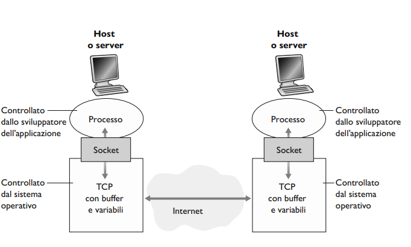

---
**Indirizzamento**

Per ricevere dei messaggi - i processi riceventi  hanno bisogno di due informazioni:

- **L'indirizzo dell'host**
- **Identificatore del processo sull'host**

In Internet ogni host è indentificato tramite un **indirizzo IP** - un numero univoco composto da 32 bit. Questo non è abbastanza perché su un hot potrebbero essere in esecuzione più processi - dobbiamo identificare quello giusto. Questo compito spetta al **numero di porta di destinazione**.

>Alcuni numeri di porta sono standardizzati per delle applicazioni - per esempio il numero 80 fa riferimento al protocollo HTTP.

---
**Servizi di trasporto disponibili per le applicazioni**

Sappiamo che un protocollo definisce il formato, l'ordine dei messaggi e le azioni prese all'arrivo o invio di messaggi. Quindi per definire un protocollo del livello di applicazione dobbiamo definire: la sintassi dei messaggi, la semantica dei messaggi e le regole per inviare e rispondere a questi messaggi.

> Si usano solitamente protocolli *aperti* - cioè di cui si conosce il **RFC** e sono pubblici.

> È importante distinguere tra applicazioni di rete e protocolli a livello di applicazione. Un protocollo a livello di applicazione è solo una parte (benché molto importante) di un’applicazione di rete.

Quali tipi di servizi forniti dal livello sottostante (livello di trasporto) servono per sviluppare un'applicazione? - Dipende.

Alcune applicazione hanno bisogno che ci sia un **integrità totale dei dati** durante il trasferimento - come applicazioni per il trasferimento di dati - altre invece tollerano delle perdite.

> Se un'applicazione fornisce questo servizio allora si dice  che fornisce un **trasferimento dati affidabile** *(reliable data transfer)*, altrimenti potrebber essere un'**applicazione che tollera le perdite** *(loss-tolerant applications)*.

Altre applicazioni hanno bisogno di avere un **ritardo nella spedizione dei dati il più piccolo possibile** - come per esempio giochi multiutente.

Non solo - alcune applicazioni per essere efficaci - hanno bisogno di spedire un minimo quantitativo di dati per essere 'funzionanti'. 

> Le applicazioni che hanno requisiti di throughput sono dette **applicazioni sensibili alla banda** *(Bandwidth-sensible applications)* - per esempio la trasmissione di video. Esistono anche **applicazioni elastiche** *(elastic applications)* - cioè applicazioni che possono fare uso di tanto o poco throughput in base a quanto ce ne sia disponibile.

L'ultima cosa che un servizio di trasporto potrebbe fornire sono servizi relativi alla sicurezza come: Integrità dei dati o cifratura dei dati.

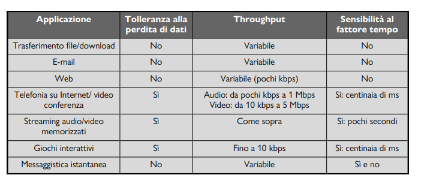

---
**Protocolli di trasporto offerti da Internet**

Internet - come ogni rete **TCP/IP** - mette a disposizione due tipi di protocolli di trasporto: **TCP** e **UDP**.

Il primo è un protocollo che fornisce un *servizio orientato alla connessione* - nella quale avviene uno sambio di messaggi *prima* che i messaggi a livello di applicazione cominciano a fluire. Questa procedura è detta **Handshake** è mette client e server in allerta preparandoli alla partenza dei pacchetti. Tramite la Handshake si crea una **connessione TCP** tra le socket dei processi. questa connessione deve essere chiusa alla fine della comunicazione. L'altra cosa che il protocollo fornisce è un *servizio di trasferimento affidabile* - quindi i messaggi vengono inviati senza errori e nell'ordine giusto. Inoltre offre un **meccanismo di controllo della congestione**.

> La connessione TCP è **full-duplex** - cioè che i processi possono scambiarsi messaggi contemporaneamente sulla connessione. 

Il secondo protocollo - UDP - è un protocollo leggero con servizio minimalista. UDP è senza connessione (niente handshake) e il trasferimento dei dati **NON** è affidabile - quindi non è detto che il messaggio - dopo aver superato la socket - arrivi al processo giusto.
Non include un meccanismo di controllo della congestione e può 'spingere' i dati al livello sottostante a **qualsiasi velocità.**

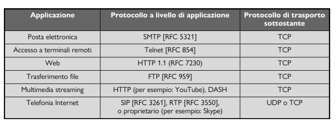

---
**Piccola sezioni sulla sicurezza**

Le prime versioni di TCP e UDP non avevano alcuni tipo di cifratura o altri servizi di sicurezza - per esempio sicurezza end to end. negli anni sessanta questi servizi erano implementati direttamente sull'applicazione. Per rendere sicuro TCP - questo è stato arricchito con il **Transport Layer Security (TLS)**  che fornisce servizi di sicurezza tra processi come:

- Controllo dell'integrità dei dati.
- Cifratura.
- Autenticazione end-to-end.

> Nota che non è un nuovo protocollo, bensì un arricchimento del TCP.

---
### Web e HTTP

Prima degli anni novanta - Internet - era usato solo da ricercatori nelle università ma - con la creazione dell'applicazione **World Wide Web** - Internet catturò l'attenzione del pubblico.

> Il Web ha elevato Internet da una semplice rete per dati ad unica rete per i dati.

Una delle caratteristiche che attira gli utenti al Web è che opera *on demand* - inoltre è facilissimo reperire e rendere disponibili informazioni. Fornisce anche una piattaforma a moltissime applicazioni con costi molto bassi.

---
**Panoramica di HTTP**

**HTTP** - HyperText Transfer Protocol - costituisce il cuore del Web - è un protocollo implementato in due programmi - client e server - in esecuzione su sistemi diversi che comunicano fra di loro tramite messaggi HTTP. Il protocollo descrive sia i **messaggi** che le **regole per la loro trasmissione**.

> Una **pagina web** è costituita da oggetti.

> Un **oggetto** è semplicemente un file indirizzabile tramite URL.

La maggior parte delle pagine web è composta da un file **HTML principale** con diversi oggetti referenziati ad esso.

Ogni URL ha due componenti:

- Nome dell'host del server che ospita l'oggetto.
- Il percorso dell'oggetto.

> Un **browser web** implementa il lato client di HTTP - mentre un **web server** implementa il lato server di HTTP e ospita gli oggetti web.

HTTP definisce come i client richiedano le pagine ai server e come questi le trasferiscano.

> Molto semplificato - quando il client richiede una pagina web il browser invia al server messaggi di richiesta HTTP per gli oggetti della pagina. Il server riceve le richieste e risponde con messaggi di risposta HTTP con gli oggetti.

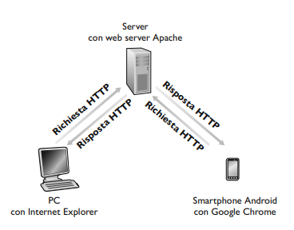

HTTP usa come protocollo di trasporto TCP quindi - il client HTTP richiede prima una connessione TCP con il server. Quando stabilita comunicano tramite le socket. Quindi il client invia richieste e riceve risposte tramite la sua socket - analogo per il server.

Quando il client manda un messaggio alla sua interfaccia socket perde il possesso del messaggio - che si trova nelle mani di TCP.

Un vantaggio della struttura a livelli è che HTTP non si deve preoccupare dell'affidabilità della tramissione - poiché garantita da TCP. HTTP è definito come **protocollo senza memoria di stato (stateless protocol)** - ossia che i server HTTP non mantengono alcuna informazione sui client che fanno le richieste.

> Web server ha un IP fisso e risponde eventualemente a milioni di client.

> Versione originale di HTTP si chiama HTTP/1.0 - dal 2020 si usa per la maggior parte delle transazioni HTTP/1.1 - anche se motli browser e web server supportano una nuova versione HTTP/2.

---
**Connessioni persistenti e non perstistenti**

In molte applicazioni di Internet - le due parti - comunicano per molto tempo - con il client che invia richieste e il server che risponde. In base all'applicazione la serie di richieste può essere effettuata in **sequenza** - **periodicamente ad intervalli regolari** o in **maniera intermittente.**

Se le interazioni hanno luogo su TCP - allora bisogna decidere se se ciascuna coppia richiesta/risposta deve essere inviata su una connessione TCP separate - ossia **non persistente** o sulla stessa connessione - ossia conenessione **persistente.**

Osserviamo vantaggi e svantaggi della connessione su HTTP.

---
**HTTP con connesioni non persistenti**

Supponiamo il trasferimento di una pagina che consiste in un file HTML e 10 immagini JPEG.

Ecco cosa avviene:

1) Processo client HTTP inizializza una connessione TCP con il server $xxx.xxx.xxx$ sulla porta $80$. Associate alla connnesione TCP ci sara una socket per client e una per il server.

2) Il client tramite la socket invia al server un messaggio di richiesta HTTP che include il percorso del sito.

3) Il processo server riceve il messaggio di richiesta attraverso la socket associata alla connessione - recupera l'oggetto dalla memoria - lo incapsula in un messaggio di risposta che viene inviato al client tramite HTTP.

4) Il processo server comunica a TCP di chiudere la connessione - ci si accerta prima che il client abbiamo ricevuto il pacchetto integro.

5) Il client riceve la risposta e la connessione termina. Il messaggio indica che il file è un HTML - quindi il client estrae il file dal messaggio di risposta esamina l'HTML e trova i riferimenti alle immagini.

6) Vengono ripetuti i primi quattro passi per ciascuno degli oggetti JPEG referenziati.

> HTTP non ha niente a vedere con il modo in cui i browser interpretano le stesse pagine.

Questi passi riportano una connessione non persistente - la connessione TCP viene chiusa dopo l'invio dell'oggetto da parte del server. In questo caso ci sono 10 connessioni TCP totali.

> Alcuni browser le riescono a fare in parallelo.

Il **RTT - Round Trip Time** è il tempo che impiega un piccolo pacchetto per viaggiare dal client al server e poi tornare al client. Tiene conto dei ritardi di propagazione.

Quando clicchiamo su un ipertesto stiamo apriamo una connessione TCP nella quale avviene un **handshake a tre vie** - ossia il client invia un piccolo segmento TCP al server e questo gli invia una conferma. Infine il client dà una conferma del ritorno al server.

> Primi due messaggi usano RTT - mentre il terzo include anche la richiesta al server insieme alla terza parte dell'handshake.

> Il tempo di richiesta-risposta consuma un altro RTT - ogni oggetto subisce un ritardo di due RTT

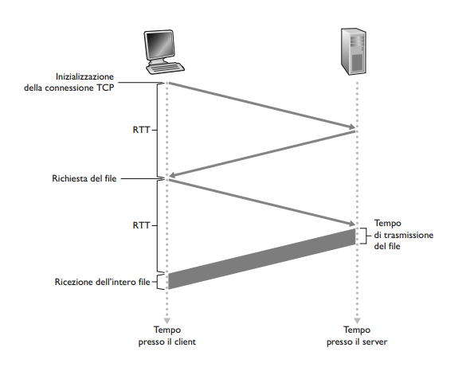

---
**HTTP con connessioni persistenti**

Il problema con le connessioni non persistenti è che per ogni oggetto dobbiamo allocare buffer e mantenere delle variabili sia per client che per il server. 

Nelle connessioni persistenti la connessioni tra client e server rimane quindi tutte le richieste e risposte vengono effettuate su un unica connessione. Il server può spedire anche *diverse pagine* sulla stessa.

> Queste richieste vengono fatte una di seguito all'altra senza aspettare le risposte delle richieste pendenti - **pipelining**.

Il server HTTP chiude la connessione se *rimane inattiva* per un lasso di tempo. Quando riceve delle richieste in sequenza invia gli oggetti con la stessa modalità di prima.

---
**Formato dei messaggi HTTP**

Ecco un tipico messaggio di richiesta HTTP:
```
GET /somedir/page.html HTTP/1.1 
Host: www.someschool.edu 
Connection: close 
User-agent: Mozilla/5.0 
Accept-language: fr
```

Sritto in ASCII e leggibile dall'utente - consiste di 5 righe seguite da un *carriage return* e un *line feed*.

La prima riga è la **riga di richiesta** - quelle succesive di intestazione. La prima riga presenta tre campi che definiscono:

- *Metodo*
- *URL*
- *Versione di HTTP*.

La riga **host** specifica l'host su cui risiede l'oggetto. La riga **Connection** specifica al server che non si deve occupare di una connessione persistente. Lo **User-Agent** identifica quale browser è usato per fare la richiesta. L'ultima riga indica se l'utente preferisce ricevere l'oggetto in una determinata lingua - in questo caso francese.

Guardiamo ora il formato generale di un messaggio di richiesta.

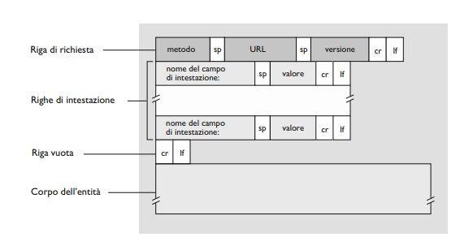

Nell'immagine sopra si nota alla fine un'ultimo campo - presente quando si fanno richieste in modalità POST - il corpo contiene ciò che l'utente ha immesso in un campo di un form.

> Le richieste generate con i form non devono per forza essere fatte tramite POST - può infatti essere usato anche il GET che includerà i dati immessi nel URL richiesto.

Altri metodi usati sono:

- HEAD - Simile al GET - quando un server riceve una richiesta con il metodo HEAD - risponde con un messaggio HTTP tralasciando gli oggetti richiesti.

- PUT - Consente agli utenti di inviare un oggetto a un percorso specifico su uno specifico web server.

- DELETE - Consente la cancellazione di un oggetto sul server.

Ecco un tipico messaggio di risposta HTTP:
```
HTTP/1.1 200 OK 
Connection: close 
Date: Thu, 18 Aug 2015 15:44:04 GMT 
Server: Apache/2.2.3 (CentOS) 
Last-Modified: Tue, 18 Aug 2015 15:11:03 GMT 
Content-Length: 6821 
Content-Type: text/html 
(data data data data data ...)
```

Nella risposta abbiamo 6 righe divise in: *riga di stato* - *riga di intestazione* e il *corpo*.

Il corpo rappresenta il fulcro del messaggio. La riga di stato presenta tre campi:

- Versione di protocollo
- **Codice di stato** 
- Messaggio di stato

Nella riga di intestazione vediamo come la connection è close - significa che il server ha intenzione di chiudere la comunicazione dopo l'invio del messaggio. La riga **date** indica l'ora e la data di creazione e invio della risposta HTTP.

> Date - Momento in cui il server recupera l'oggetto dal suo file system.

La riga **server** indica il tipo di server che ha generato la risposta - mentre user-agent è analoga alla richiesta. **Last-modified** indica l'istante in cui l'oggetto è stato creato o modificato per l'ultima volta. Le ultime due specificano il numero di byte dell'oggetto inviato e il tipo di file. 

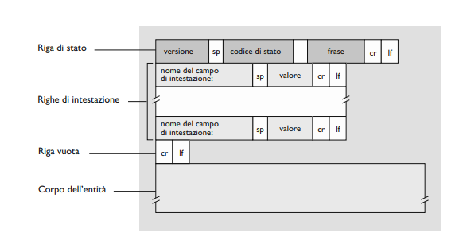

Il codice di stato e l'espressione associata indicano il risultato della richiesta. Tra i codici più comuni troviamo:

- $200$ **OK** - La richiesta ha avuto successo e in risposta invia l'informazione.

- $301$ **Moved Permanently** - L'oggetto richiesto è stato trasferito in modo permanente

> URL indicano nell'intestazione *location* del messaggio di risposta.

- $400$ **Bad Request** - Errore generico indica che la richiesta non è stata compresa dal server.

- $404$ **Not Found** - Il documento richiesto non esiste sul server.

- $505$ **HTTP Version Not Supported** - Il server non dispone della versione di protocollo HTTP richiesta.

---
**Interazione utente-server: i cookie**

I server HTTP sono privi di stato - però a volte è utile che i server possano identificare gli utenti. Per questo motivo HTTP adotta i **cookie**.

> Consentono di tenere traccia degli utenti.

Questa tecnologia presenta quattro componenti:

1) Una riga di intestazione nel messaggio di risposta HTTP.

2) Una riga di intestazione nel messaggio di richiesta HTTP.

3) File mantenuto sul sistema dell'utente e gestito dal browser.

4) Un database sul sito.

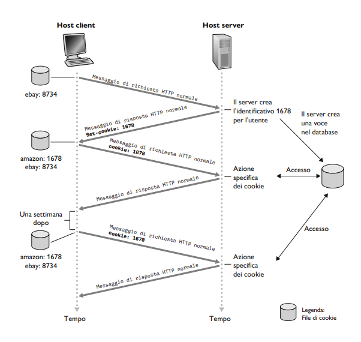

Nella risposta HTTP sarà presenta l'intestazione **Set-cookie** che contiene il numero identificativo per l'utente.

Ogni volta che accedi ad una pagina web il browser consulta il file dei cookie sul dispositivo - estrae il numero identificativo per il sito web e pone nella richiesta HTTP una riga di intestazione dei cookie. In questo modo il browser si ricorda se hai fatto già fatto l'accesso ad un sito.

> Sono fonte di controversie - possono essere considerati una violazione della privacy dell'utente.

---
**Web caching**

Una **web cache** o **proxy server** è un'entità di rete che soddisfa richieste HTTP al posto del web server. Il proxy ha una propria memoria cache in cui conserva gli oggetti recentemente richiesti.

Il browser stabilisce prima di tutto una connessione con il proxy per un oggetto - se questo ha l'oggetto in memoria lo invia come risposta al browser - altrimenti apre una connessione con il server per ricevere l'oggetto richiesto. Una volta ricevuto l'oggetto salva una copia nella sua cache e inoltra un'altra copia al browser in un messaggio di risposta HTTP.

> Un proxy è *sia server che client*.

Sono generalmente acquistati e installati da un ISP e ha il compito di **ridurre** i tempi di risposta alle richieste dei client. Se l'ampiezza di banda costituisce un collo di bottiglia tra client e server il proxy è perfetto per eliminare il collo di bottiglia fornendo una **connessione ad alta velocità.**

> Con l'aumento delle *Content Distribution Network (CDN)* i proxy server giocano un ruolo sempre più importante in Internet.

---
**GET condizionale**

HTTP presenta un meccanismo che permette alla cache di verificare se i suoi oggetti sono sempre aggiornati - in modo tale da non rispondere con oggetti 'vecchi' - Il meccanismo si chiama **GET condizionale**.

Un messaggio di risposta si dice GET condizionale se:

1) Usa il metodo GET.

2) Include una riga di intestazione **If-modified-since**

Il funzionamento è semplice il proxy fa una richiesta al server e riceve una risposta - nella risposta ci sta la riga **last-Modified** e il proxy copia il valore su quella riga nella sua di riga **If-modified-since**. Se il proxy prova poi a fare un'altra richiesta viene controllato se l'oggetto è stato modificato dalla data presente sulla riga - se non è stato modificato il server risponde con un messaggio con la riga di stato 304. 

---
**HTTP/2**

Standardizzato nel 2015 è stata la prima nuova versione di HTTP da HTTP/1.1. Lo scopo principale è quello di ridurre la latenza percepita usando il *multiplexing di richiesta e risposta* su una singola connessione TCP - fornire supporto per la priorità di richiesta e il server push e di fornire una compressione efficiente dei campi di intestazione HTTP.

> Non cambia metodi - codici di stato - URL
> Cambia il modo in cui i dati vengono formattati e trasportati.

E' stato introdotto per eliminare il problema dell'**Head of Line blocking** presente sulle connessioni persistenti TCP del HTTP/1.1.

> **Head of Line blocking**: Un oggetto pensate in testa blocca tutti gli oggetti più piccoli dietro di lui.

In HTTP/1.1 si aggirava il problema aprendo più connessioni TCP parallele - in questo modo gli oggetti più piccoli possono arrivare ed essere riprodotti nel broeser più velocemente -riducendo il ritardo percepito dall'utente. Ogni connessione parallela riceve $1/n$ della larghezza di banda.

Lo scopo di HTTP/2 è quello di eliminare o ridurre il numero di connessioni TCP parallele per il trasporto di una singola pagina web.

La soluzione di HTTP/2 è quella di suddividere ogni messaggio in piccoli frame e alternare messaggi di richiesta e risposta sulla stessa connessione. 

> Vengono inviati in modo alternato i frame degli oggetti più pesanti con quelli più piccoli.

Questo processo è eseguito dal sottolivello di framing del protocollo è il processo erende il nome di **framing**. I frame che arrivano al client vengono ricostruiti nei messaggi di risposta originali nel sottolivello di framing e poi elaborati dal browser. Allo stesso modo le richieste HTTP.

---
**Priorità dei messaggi di risposta e server pushing**

Questo meccanismo permette di modificare la **priorità relativa delle richieste** per ottimizzare le prestazioni dell'applicazione. Quando vengono inviati degli stream paralleli al server - il client - può decidere di assegnare un peso compreso tra 1 e 256 a ciascun messaggio. 

> Ogni peso indica la priorità - inoltre si può anche indicare la dipendenza di ogni messaggio specificando l'ID del messaggio da cui dipende.

Altra caratteristica di HTTP/2 è che il server può effettuare un invio *push* di oggetti aggiuntivi al client. Questo si può fare perché la pagina di base HTML indica gli oggetti necessari per il rendering della pagina - quindi invece di aspettare delle richieste HTTP per ogni oggetto - il server analizza HTML e identifica gli oggetti necessari e li invia al client *prima di ricevere le richieste esplicite per essi*. Il server push elimina latenza aggiunta dal dover aspettare le richieste.

---
**HTTP/3**

**QUIC** -> Nuovo protocollo di 'trasporto' implementato nel livello di applicazione sul protocollo UDP. Offre diverse funzioni per HTTP come multiplexing dei messaggi - controllo del flusso per ogni stream e creazioni di connessioni a bassa latenza. HTTP/3 è un nuovo protocollo progettato per funzionare su QUIC.

---
### Posta elettronica in Internet

Presenta fin dagli albori di Internet - rappresenta mezzo di comunicazione asincrono. Con caratteristiche di velocità, possibilità di avere allegati e collegamenti ipertestuali. In questo paragrafo ci occuperemo dei protocolli usati per implementare la posta elettronica.

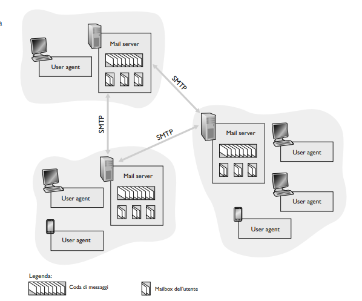

Il sistema postale di Internet si basa su tre componenti principali:

- **User-Agent** - Consentono agli utenti di leggere - rispondere - inoltrare - salvare e comporre messaggi.

> uno **user agent** è un'applicazione installata sul computer dell'utente che si connette a un processo server.

> Quando Alice compone un messaggio lo user-agent lo invia al server di posta che lo mette nella coda dei messaggi di uscita. Al contrario - lo user agent di bob - lo preleva dalla casella di posta del suo mail server.

- **Mail server** - Parte centrale del servizio di posta elettronica comprende una **mail-box** collocata nella mail server.

> Tipico viaggio di un messaggio parte dallo user agent - giugne al meail server del mittente e prosegue fino al mail server del destinatario - dove è depositato nella sia cartella.

Bob deve avere essere autenticato dal server per poter accedere ai messaggi della sua casella tramite nome utente e password. Il server di Alice deve anche tenere di conto di alvuni problemi del server di Bob - se infatti non gli può consegnare la posta deve trattenere il messaggio in un **coda di messaggi** e poi riprovare.

- **Protocollo SMTP** - protocollo principali a livello di applicazione della posta elettronica. Fa affidamento del TCP per trasferire la mail dal server del mittente a quello del destinatario. Presenta un lato client e server - il primo in esecuzione sul mail server del mittente, l'altro in esecuzione del mittente.

> Entrambi i lati possono essere eseguiti su tutti i server di posta - se un server invia posta a un altro - agisce come client - quando la riceve - funziona come server.

---
**SMTP**

E' il protocollo cuore della posta elettronica - ha il compito di treasferire messaggi dal mail server del mittente a quello destinatario. E' più vecchio del HHTP - per questo motivo ci sono alcune restrizioni che non hanno molto senso oggi.

> Per esempio - tratta il corpo di tutti i messaggi come semplice ASCII a 7 bit. Questa cosa richiede che i messaggi vengano codificati e decodificati prima e dopo essere inviati.

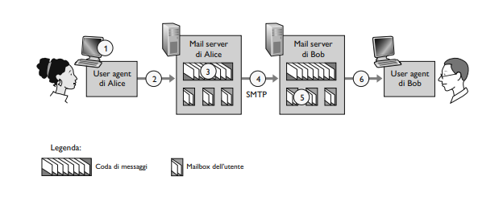

> SMTP *non usa mail server intermedi* - la connessione TCP ha luogo direttamente fra i due server.

Durante lo scambio - il client SMTP - fa stabilire una connessione TCP sulla **porta 25** verso il server SMTP. Tramite **handshake** ci assicuriamo che i trasferimenti avvengano in maniera sicura.

Durante la trascrizione di messaggi scambiati esistono dei comandi che vengono usati: *MAIL - FROM - RCPT - TO - DATA - QUIT*.

---
**Formati dei messaggi di posta**

Il corpo deim messaggi è preceduto da un'**intestazione** - questa comprende - come per HTTP - delle righe con testo leggibile. Alcune parole chiave obbligatorie sono: *From* e *To*.

> Queste parole chiavi sono **diverse** rispetto ai comandi di SMTP - le prime fanno parte del messaggio - i secondi sono parte del protocollo SMTP.

Dopo l'intestazione abbiamo una riga vuota e quindi il corpo del messaggio in ASCII.

---
**Protocolli di accesso alla posta**

Si potrebbe pensare di collegare un mail server direttamente sul computer del destinatario in modo tale da saltare il passaggio di invio di messaggi a server intermedi - ma ci sta un problema.

Se questo fosse possibile il computer del destiantario *dovrebbe rimanere sempre accesso* in attesa di messaggi - quindi è meglio avere un **user-agent sull'host locale** dal cui si accede alla propria casella memorizzata su un mail server condiviso.

Lo user-agent del mittente non dialoga con il server del destinatario - piuttosto usa SMTP per spedire il messaggio sul suo mail server che poi userà SMTP per spedirlo al server del destinatario. Come fa un destinatario che esegue uno user agent localmente a ottenere i messaggi che si trovano sul suo wen server?

> Non può usare SMTP perchè è un protocollo **push**.

Al momento esistono due modi per fare ciò:

- Se si usa posta elettronica bassata sul web allora lo user agent userà HTTP insieme ad un'interfaccia SMTP.

- Si utilizza il protocollo **IMAP.**

---
### DNS - Il servizio di directory di Internet

Gli host di Internet possono essere identificati in diversi modi. Gli **Hostname** sono perfetti per le persone - ma non forniscono informazioni sulla loro posizioni in Internet. Molti hostname sono alfanumerici - il che rende l'elaborazione da parte dei server complicata. Per questo motivo gli host possono essere identificati anche tramite **indirizzi IP.**

> Gli IP sono composti da 4 byte separati da un punto - ogni byte rappresenta un numero da 0 a 255 - inoltre sono **gerarchici** - ossia che leggendolo da sinistra verso destra otteniamo informazioni sempre più dettagliate sulla posizione dell'host in Internet.

---
**Servizi forniti da DNS**

Per poter coinciliare le due modalità di scrittura di un indirizzo IP necessitiamo di un modo per **tradurre** gli hostname nei loro indirizzi IP - questa è il compito del **DNS - Domain Name System.** Un DNS è:

- Un database distribuito implementato in una gerarchia di **DNS server**

- Un protocollo a livello di applicazione che consente agli host di interrogare il database.

Sono generalmente macchine UNIX che eseguono *BIND - Berkeley Internet Name Domain*. Usa il protocollo UDP e la porta 53. Viene solitamente usato anche da HTTP e SMTP.

> Quando facciamo una richiesta ad un sito web facciamo prima un **interrogazione** al DNS per ottenere l'ip corrispondente all'hostname.

La traduzione del hostname da parte del DNS aggiunge un *ritardo sostanziale* - ma solitamente l'indirizzo IP desiderato si trova spesso nella cache di un DNS server vicino.

DNS mette a disposizione anche altri servizi come:

- **Host aliasing** - Sono dei sinonimi più semplici più facili da ricordare rispetto all'**hostname canonico.**

- **Mail server aliasing** - Stessa idea ma per le e-mail.

- **Distribuzione del carico di rete** - semplicemente il DNS permette la redistribuzione del carico di rete per quei siti che hanno molto traffico e quindi replicati su più server. Quindi nel database un hostname canonico potrebbe avere diversi indirizzi IP associati.

---
**Panoramica del funzionamento di DNS**

Supponiamo che un'applicazione necessita di tradurre un hostname in indirizzo IP -l'applicazione **invocherà** il lato client del DNS.

> `gethostbyname()` è la funzione invocata sulle macchine UNIX per ottenere il servizio di traduzione.

Il DNS sull'host prende il controllo - inviando delle query sulla rete - queste vengono inviati in **datagrammi UDP** diretti alla porta $53$. Il client host riceve un messaggio di risposta passata poi all'applicazione.

> Per l'host il DNS è una scatola nera che permette le traduzioni. Tuttavia la scatola è costituita da **molti server DNS e da un protocollo a livello di applicazione** che specifica comunicazioni tra server DNS e host.

Potremmo avere un unico server DNS centralizzato - ma considerando gli host presenti in Internet - questo non riuscirebbe a gestirli tutti. Di seguito i problemi legati a questa schema:

- **Un solo point of failure**

- **Volume di traffico troppo elevato**

- **Database centralizzato distante**

- **Manutenzione**

> Essenzialmente questo schema *non è scalabile* - quindi inadeguato per la crescita di Internet.

---
**Un database distribuito e gerarchico**

Per togliere questi problemi possiamo usare molti server DNS organizzati in maniera gerarchica e distribuiti nel mondo. Esistono tre classi di DNS server:

- **Root server** - sono circa 1000 in tutto il mondo. Sono copie di 13 diversi root server gestiti da 12 organizzazioni e coordinate attravero la *Internet Assigned Number Authority* - **forniscono gli indirizzi IP del TLD server**.

- **Top-level domain (TDL)** - Si occupano di domini di primo livello - ossia org - com - edu - e anche quelli relativi ai vari paesi - **forniscono gli indirizzi IP dei server autoritativi**.

- **Server autoritativi** - Ogni organizzazion deve fornire record DNS pubblicamente accessibili che associano i nomi di tali host a indirizzi IP. Questo server mantiene i record.

Esiste anche un altro tipo di server DNS - ossia il **DNS server locale**. Ogni ISP ha un DNS server locale. Qunado l'host accede ad un ISP questo gli fornisce un IP tratto dai supi DNS - solitamente tramite **DHCP**.

> Le richieste DNS possono essere **query ricorsive** e **query iterative** - la prima chiede al server DNS di fornire il record di risorsa richiesto o un messaggio di errore se non si riesce ad individuare il record. La seconda viene usata per una ricerca più dettagliata andando a cercare la query anche in server DNS di livello inferiore.

---
**DNS Caching**

Possiamo sfruttare le cache per migliorare i tempi di traduzione. Il DNS server che riceve una risposra DNS può mettere in cache le informazioni contenute nella risposta.

---
**Record e messaggi DNS**

I server che implementano il database dei DNS memorizzano dei **record di risorsa** che forniscono la corrispondenza nomi-indirizzi. Un RR contiene i seguenti campi.
```
(Name, Value, Type, TTL)
```

Il TTL è il **Time to Live** - il tempo residuo di vita di un record quando scade la risorsa è eliminata dalla cache. Il significato di Name e Value dipendono da quello di Type.

- $Type = A$ allora Name è il nome dell'host e Value è il suo indirizzo IP.

- $Type = NS$ allora Name è un dominio e Value è l'hostnamen del DNS server autoritatico che sa ottenere gli IP degli host nel dominio.

- $Type = CNAME$ allora Value è il valore canonico dell'host per il sinonimo Name.

- $Type = MX$ allora Value è il nome canonico di un mail server che ha il sinonimo Name.

> L'ultimo tipo consente agli hostname dei mail server di avere sinonimi semplici.

---
**Messaggi DNS**

Query e messaggi di risposta del DNS hanno lo **stesso formato** - ossia:

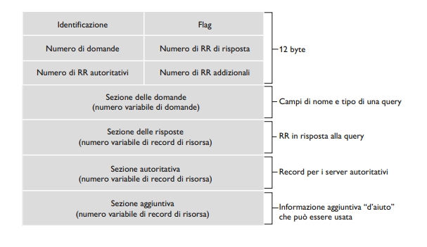

- *Sezione di intestazione* composta da 12 byte che contiene al suo interno altri campi. 16 bit che identificano la **richiesta** - viene copiato nei messaggi di risposta. campo flag che indica se un messaggio è una **richiesta (0) o risposta (1).** Se il DNS è autoritativo può impostare un bit di **richiesta di ricorsione** - effettua ricorsione se non si dispone del record. I 4 campi rimanenti identificano il *"numero di"* occorenze delle quattro sezioni.

- *Sezione domande* composta da informazioni sulle richieste - include il **nome** che sta per essere richiesto e il **tipo di della domanda** sul nome.

- *Sezione delle risposte* contiene i record di risorsa relativi al nome richiesto.

- *Sezione autoritativa* contiene i record di altri server autoritativi.

- *Sezione aggiuntiva* racchiude altri record utili.

> Con **nslookup** si può inviare un messaggio di richiesta DNS a un DNS server direttamente dalla macchina su cui si lavora.

---
**Inserimento di record nel database DNS**

Per inserire un record in un database DNS dobbiamo registrare il nome di dominio presso un ented i registrazione - ossia un **registrar** che ha il compito di verificare l'unicità del nome di dominio e lo inserisce nel DB DNS.

> Bisogna fornirgli anche i nomi e gli indirzzi IP dei nostri DNS server autoritativi primario e secondario.

Per ogni server l'ente si accerterà di inserire un recodi di tipo NS e di tipo A nei TLD server relativi.

---
### Distribuzione di file P2P

Tutte le applicazioni descritte finora sono estremamente dipendenti dall'infrastruttura di server sempre attivi. Nell'architettura P2P la **dipendenza e minima o assente.**

> I peer sono computer controllati dagli utenti che comunicano direttamente l'uno con l'altro.

> Applicazione che usa questa stuttura - distribuzione di un file voluminoso da un singolo server a un grande numero di host. Per esempio **BitTorrent**.

---
**Scalabilità dell'archittetura P2P**

Illustriamo la scalabilità dell'architettura:

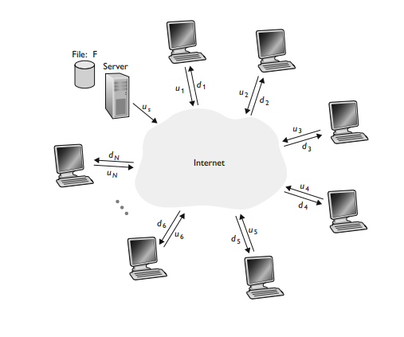

Sia $u_i$ la banda di upload del collegamento di accesso al server - mentre $d_i$ la banda di download del collegamento di accesso dell'i-esimo peer. Sia $F$ la dimensione del file da distribuire in bit e $N$ il numero di peer che vuole fare una copia del file.

> **Tempo di distribuzione:** Tempo richiesto perché tutti gli $N$ peer ottengano una copia del file. 

Per ipotesi il nucleo di Internet ha banda in abbondanza - gli unici colli di bottiglia sono nelle reti di accesso e i peer stanno non stanno lavorando su altre applicazioni.

Determiniamo il tempo di distribuzione del file per l'architettura client-server $D_{cs}$ - in questa architettura nessun peer aiuta nella distribuzione. Intanto:

- Il server trasmette una copia del file ad $N$ peer - quindi $NF$ bit - il tempo di distribuzione del file è almeno $NF/u_s$.

- Sia $d_{min}$ la banda di download del peer con il valore minore - ossia $d_{min} = min(d_1,..,d_n)$ quinfdi il peer per ricevere tutti gli $F$ bit impiega almeno $F/d_{min}$.

Mettendo assieme le osservazioni otteniamo: $$D_{cs}\geq max[\frac{NF}{u_s},\frac{F}{d_{min}}]$$
Questo è un limite inferiore al tempo di distribuzione minimo per l'architettura client-server. Consideriamolo come il tempo di distribuzione effettivo: $$D_{cs}=max[\frac{NF}{u_s},\frac{F}{d_{min}}]$$
Per $N$ abbastanzi grandi - il tempo di distribuzione è dato da da $NF/u_s$ - quindi aumenta in modo **lineare** con il numero di $N$ peer. Facciamo ora l'esempio con l'architettura P2P - quindi quando un peer riceve i dati di un file può usare la sua capacità di upload per redistribuire i dati ad altri peer.

Il calcolo è più complesso perché dobbiamo tenere di conto delle capacità di upload di ogni peer. Possiamo comunque calcolare una stima - intanto:

- Il server trasmette un solo bit del file almeno una volta nel collegamento di accesso - il tempo minimo di distribuzione è $F/u_s$.

- Il peer con velocità di download minore non può ottenere tutti i bit in meno di $F/d_{min}$ secondi.

- La capacità totale di upload del sistema nel suo complesso è uguale alla velocità di upload del server più quella di ogni peer - ossia: $u_{tot}=u_s+u_1+...u_N$ - gli $NF$ bit non possono essere consegnati ad una velocità superiore di $u_{tot}$ - quindi il tempo di distribuzione minimo è: $$NF/(u_s+u_1+...+u_N)$$
Mettendo assieme le osservazioni notiamo come il tempo di distribuzione minimo per l'architettura P2P è: $$D_{P2P}\geq max[\frac{F}{u_s},\frac{F}{d_{min}},\frac{NF}{u_s+\Sigma^N_{i=1}u_i}]$$
Ovviamente come nel caso precedente questa disuguglianza ci offre un minimo di tempo di distribuzione - ossia: $$D_{P2P} = max[\frac{F}{u_s},\frac{F}{d_{min}},\frac{NF}{u_s+\Sigma^N_{i=1}u_i}]$$
Mettendo a confronto i due risultati ottenuti vediamo come la distribuzione peer-to-peer è molto più veloce rispetto alla distribuzione con architettura client-server.

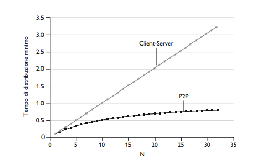

---
**Bittorrent**

Protocollo P2P per la distribuzione di file - l'insieme di tutti i peer è detto **torrente** - mentre i peer in un torrent scaricano **chunk** del file di uguale dimensione. Quando un peer entra a far parte del torrent non ha nessun chunk del file.
Con il passare del tempo accumula chunk - che mentre scarica - invia ad altri utenti. Una volta acquisito tutto il file può:

- **Rimanere** nel torrent e continuare ad inviare chunk ad altri peer

- **Uscire** dal torrent.

> In qualunque caso si può lasciare un torrent per poi riprenderlo in seguito.

Ciascun torrent ha un nodo di infrastruttura detto **tracker** - quando un peer entra in un torrent informa il tracker della sua presenza in modo periodico. Quando un peer entra nel torrent il tracker invia a questo peer gli **indirizzi IP** di un sottoinsieme di tutti i peer.

Il nuovo peer cercherà di stabilire delle **connessioni TCP** con tutti i peer della lista - questi si chiamano *neighbour peer*.

Periodicamente ogni peer chiederà ad ogni vicino di scambiare i chunk - poiché ogni peer ha chunk diversi ad ogni istanza. Il nostro peer deve quindi prendere due decisioni importanti:

- *Quali chunk richiedere ai vicini*

- *A quali vicini deve inviare i suoi chunk*

La tecnica usata dal nostro peer è la **rarest first** - ossia richiede le copie dei chunk che ancora gli mancano tra quelli che hanno il minor numero di copie ripetute tra i vicini.

Per determinare a quali peer inviare i suoi chunk invece usa un *algoritmo di trading intelligente* - il nostro peer attribuisce una *priorità* ai vicini che gli stanno inviando chunk alla velocità maggiore. *Determina quindi i quattro peer che gli stanno passando i bit a velocità maggiore.* (Questo avviene ogni 10 secondi) e comincia a passare chunk ai quattro peer.

> Questi quattro peer sono detti **unchoked**.

Ogni 30 secondi sceglie anche un vicino casuale e gli invia dei chunks - questo è detto **optimistically unchoked** - praticamente questo peer diventa un possibilie 'compagno di scambio con il nostro peer'.

L'effetto è che i peer in grado di inviare dati a velocità compatibili tendono a trovarsi - unito alla ricerca casuale di un vicino possiamo anche trovare chunk che non avevamo.

> Il restante dei peer è detto **choked**.

Questo meccanismo è chiamato *tit-for-tat* - molto usato anche se dimostrato che può essere aggirato.

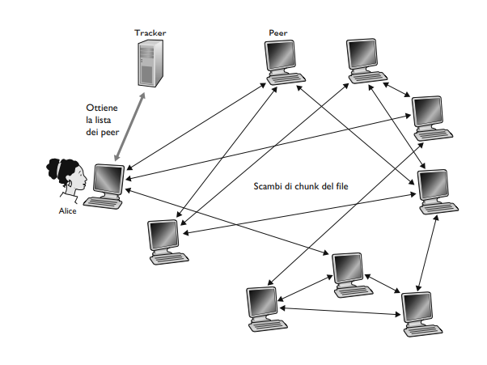

> **Tabelle Hash Distribuite (DHT):** Semplici database i cui record sono distribuiti tra i peer di un sistema P2P.

---
### Streaming video e reti per la distribuzione di contenuti

Lo streaming di video rappresenta circa 80% del traffico di Internet. Prima di entrare nel dettaglio di come vengono trasmessi è utile capire le caratteristiche di un video.

Un video è una *sequenza di immagini* - solitamente 24 o 30 immagini al secondo. Un'immagine non compressa e codificata consiste in un **array di pixel** - ognuno codificato con un numero di bit per rappresentare luminanza e crominanza. I video possono essere compressi per raggiungere un compromesso tra qualità e bit rate.

Una caratteristica importante è l'elevata velocità con cui è necessario inviare i bit sulla rete. Tradotto significa che abbiamo bisogno di enormi quantità di traffico e spazio di archiviazione.

Possiamo usare la compressione per avere versioni multiple del video a qualità diverse - in modo tale che ogni utente può decidere la versione da guardare in funzione della larghezza di banda disponibile.

---
**Streaming HTTP e DASH**

Nello streaming HTTP - il cliente stabilisce una connessione con il server che mantiene il video salvato come file ordinario con URL specifico. Viene fatta una richiesta GET HTTP per il suo URL e il server invia il file in un messaggio di risposta HTTP. Dal lato client i byte sono memorizzati in un buffer e quando raggiungono una certa soglia vengono riprodotti.

> I frame del video sono presi dal buffer - decompressi e visualizzati.

Un problema è che tutti i client ricevono la stessa versione del video indipendentemente dalla larghezza di banda. Per questo motivo è stato inventato un nuovo tipo di straming HTTP - ossia lo **streaming dinamico adattivo su HTTP (DASH)**.

In questa versione i video sono **codificati in diverse versioni** - ognuna con bit rate e qualità diversa. Se la banda disponibile è ampia allora il client richiede una versione con bit rate alto altrimenti viceversa. Permette anche di adattare la scelta della versione alla banda disponibile.

> Video in versioni diverse hanno URL diversi - nei server HTTP esiste un file di descrizione detto **manifest file** che per ogni versione fornisce il rispettivo URL e bit rate. Quindi durante una richeista dal client questo deve richiedere inanzitutto il manifest file.

Mentre scarica blocchi - il client misura la banda di ricezione ed esegue un algoritmo per selezionare il blocco successivo.

---
**Reti per la distribuzione di contenuti**

Molte aziende distribuiscono milioni di video a milioni di utenti. Mandare in streaming tale mole di traffico è una sfida.
L'approccio più diretto sarebbe avere un **unico data center** dove sono memorizzati tutti i video e vengono mandati in streaming - ma questo approccio ha tre grandi problemi:

- Se il client è lontano dal data center - i **pacchetti dovranno percorrere un lungo cammino** passando per molti ISP diminuendo il throughput totale end-to-end.

> Siccome ci sono molti collegamenti è molto più probabile avere più colli di bottiglia.

- Un video popolare **verrebbe inviato molte volte sullo stesso collegamento** sprecando banda e costringendo l'azienda a pagare tutte le volte il suo ISP per mandare gli stessi dati.

- Un singolo data center è anche un **singolo punto di rottura.**

Per superare queste problematiche si usano le **CDN** - ossia le *Content Distribution Networks* - ha il compito di gestire server distribuiti in posti diversi. Queste possono essere **private** - ossia di proprietà del fornitore di contenuti oppure **di terze parti** che distribuisce contenuti per conto di molti fornitori.

Le CDN adottano due politiche di dislocazione:

- **Enter deep** - Entrare in profondità nelle reti d'accesso degli ISP installando dei gruppi di server detti anche cluster. L'idea è quella di **essere vicini agli utenti finali** diminuendo i collegamenti tra l'utente e il cluster CDN e diminuendo i tempi di throughput. 

- **Bring Home** - Costruire grandi cluster in **pochi punti chiave e interconnetterli usando una rete privata**. Invece di entrare negli ISP questi CDN pongono i cluster negli IXP.

Posizionati i cluster - la CDN replica i contenuti su di essi. Molte CDN non spingono i loro video verso i cluster - ma usano una strategia per cui se un client tichiede un video a un cluster che non lo ha memorizzato - il cluster recupera il video da un archivio centrale o da un altro cluster.

---
**Come funziona la CDN**

Quando un browser nell'host di un utente richiede un video indentificato da URL - la CDN deve **intercettare la richiesta** in modo da poter:

1) **Determinare il cluster** di server per quel client a quell'istante.

2) **Dirigere la richiesta del client a uno dei server** di quel cluster.

Esaminiamo adesso i meccanismi dietro l'intercettazione e il reindirizzamento di una richiesta. Per fare ciò molte CDN usano il servizio DNS - facciamo un esempio dal libro:

>supponete che un fornitore di contenuti, NetCinema, impieghi una CDN di terza parte, KingCDN, per distribuire i suoi video. A ogni video sulla pagina web di NetCinema viene assegnato un URL che include la stringa “video” e un identificatore univoco per tale video; per esempio, al video Transformers 7 potrebbe essere assegnato http://video.netcinema.com/6Y7B23V. Come mostrato nella Figura, vengono quindi compiuti 6 passi:

1) L'utente visita la pagina.

2) Quando l'utente clicca sul link il suo host invia una interrogazione DNS al sito.

3) Il **DNS server locale** dell'utente invia l'interrogazione DNS a un DNS di NetCinema - questo DNS autoritativo per passare l'interrogazione DNS a KingCDN invia il nome di un host nel dominio di KingCDN al DNS server locale.

4) Il **LDNS** invia una seconda interrogazione al server autoritativo per KingCDN - qui viene specificato il server CDN da cui il client riceverà il contenuto.

5) **LDNS** inoltra l'indirizzo IP del nodo CDN che fornirà il contenuto all'host dell'utente.

6) Il client - ricevuto l'IP - stabilisce una connessione TCP e invia una richiesta GET HTTP - se viene usato DASH viene prima inviato un file che specifica i vari URL per le versioni diverse del video.

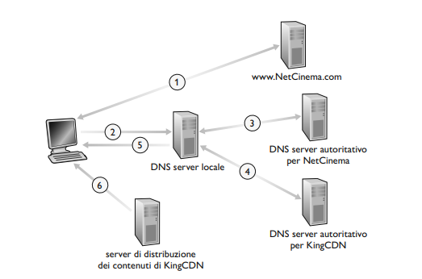

---
**Strategie di selezione dei cluster**

Questo è il cuore per l'installazione di una CDN - esistono diversi approcci ognuno con vantaggi e svantaggi.

La prima idea è assegnare a un client il cluster *geograficamente più vicino* - gli indirizzi IP degli LDNS sono aasociati a un luogo geografico. Quindi quando un CDN riceve una richiesta DNS **sceglie il cluster a esso più vicino.**

> Problemi: Il cluster più vicino geograficamente potrebbe essere diverso da quello più vicino dal punto di vista del percorso in rete. Non tiene conto di variazioni temporali.

La seconda strategia determina il cluster migliore per un client basandosi sulle condizioni di traffico correnti - effettuando **misure in tempo reale** delle prestazioni di ritardo e predita tra cluster e client. Per esempio attraverso dei ping.

> Un problema è che molti LDNS sono configurati per non rispondere a tali richieste.
